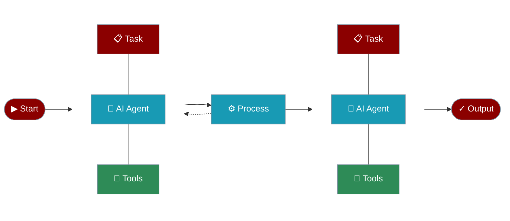

# AI Agents

PraisonAI provides a diverse set of specialized agents for various tasks. Each agent is designed with specific capabilities and tools to handle different types of tasks effectively.



## Data & Analysis

## Media & Content

## Search & Recommendations

## Development

## Getting Started

Each agent can be easily initialized and customized for your specific needs. Here's a basic example:

```python
from praisonaiagents import Agent

# Create an agent with specific instructions

agent = Agent(instructions="Your task-specific instructions")

# Start the agent with a task

response = agent.start("Your task description")
```

For more detailed information about each agent, click on the respective cards above.