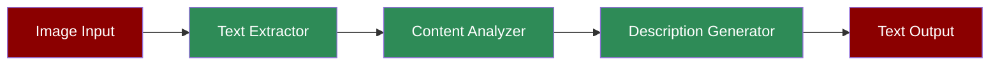

# Image to Text Agent



A workflow demonstrating how the Image-to-Text Agent can extract text from images and generate comprehensive descriptions.

## Quick Start

## Understanding Image-to-Text Conversion

The Image-to-Text Agent combines multiple capabilities to convert visual content into textual form:
1. **OCR Processing**: Extracts text from images using optical character recognition
2. **Layout Analysis**: Understands the spatial arrangement of text and visual elements
3. **Content Description**: Generates natural language descriptions of image content
4. **Text Formatting**: Preserves text formatting and structure where possible

## Features

## Example Usage

```python
# Example: Processing a document image

document_task = Task(
 name="process_document",
 description="Extract text and analyze document layout",
 expected_output="Extracted text with layout information",
 agent=image_text_agent,
 images=["business_document.jpg"]
)

# Run single task

agents = PraisonAIAgents(
 agents=[image_text_agent],
 tasks=[document_task],
 process="sequential"
)
agents.start()
```

## Next Steps

- Learn about [Prompt Chaining](/features/promptchaining) for complex document processing
- Explore [Evaluator Optimizer](/features/evaluator-optimiser) for improving text extraction accuracy
- Check out the [Image Agent](/agents/image) for pure image analysis capabilities