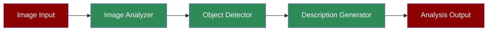

# Image Analysis Agent



A workflow demonstrating how the Image Analysis Agent can process and analyze visual content, detect objects, and generate detailed descriptions.

## Quick Start

## Understanding Image Analysis

The Image Analysis Agent is designed to process and understand visual content through several key capabilities:
1. **Image Input**: Supports both URL and local file inputs
2. **Object Detection**: Identifies and locates objects within images
3. **Architectural Analysis**: Specialized in analyzing architectural features
4. **Spatial Understanding**: Describes spatial relationships between objects

## Features

## Example Usage

```python
# Example: Analyzing a landmark image

landmark_task = Task(
 name="analyze_famous_landmark",
 description="Analyze this historical landmark",
 expected_output="Architectural details and historical significance",
 agent=image_agent,
 images=["https://example.com/landmark.jpg"]
)

# Run single task

agents = PraisonAIAgents(
 agents=[image_agent],
 tasks=[landmark_task],
 process="sequential"
)
agents.start()
```

## Next Steps

- Learn about [Prompt Chaining](/features/promptchaining) for complex image analysis workflows
- Explore [Evaluator Optimizer](/features/evaluator-optimiser) for improving analysis accuracy
- Check out the [Video Agent](/agents/video) for video content analysis