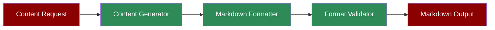

# Markdown Agent



A workflow demonstrating how the Markdown Agent can generate and format content in Markdown syntax.

## Quick Start

## Understanding Markdown Generation

The Markdown Agent specializes in creating properly formatted Markdown content:
1. **Content Generation**: Creates original content based on prompts
2. **Markdown Formatting**: Applies proper Markdown syntax
3. **Structure Validation**: Ensures correct formatting
4. **Document Organization**: Creates well-structured documents

## Features

## Example Usage

```python
# Example: Generate a technical documentation

agent = Agent(
 instructions="You are a Markdown Agent, output in markdown format"
)

# Generate API documentation

response = agent.start("""
 Create technical documentation for a REST API with:
- Introduction
- Authentication
- Endpoints
- Examples
""")

# Save documentation

with open('api_docs.md', 'w') as f:
 f.write(response)
```

## Next Steps

- Learn about [Prompt Chaining](/features/promptchaining) for complex document generation
- Explore [Evaluator Optimizer](/features/evaluator-optimiser) for improving content quality
- Check out the [Documentation Agent](/agents/documentation) for specialized documentation generation