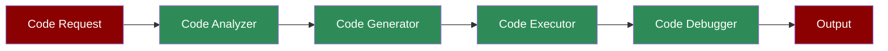

# Programming Agent



A workflow demonstrating how the Programming Agent can analyze, generate, execute, and debug code.

## Quick Start

## Understanding Code Development

The Programming Agent combines multiple tools for comprehensive code development:
1. **Code Tools**:
- `execute_code`: Run Python code
- `analyze_code`: Analyze code structure
- `format_code`: Format code to standards
- `lint_code`: Check code quality
- `disassemble_code`: View bytecode
2. **Shell Tools**:
- `execute_command`: Run terminal commands
- `list_processes`: View running processes
- `kill_process`: Terminate processes
- `get_system_info`: System information
3. **Web Tools**:
- `duckduckgo`: Search for programming resources

## Features

## Example Usage

```python
# Example: Create and run a data analysis script

response = agent.start("""
1. Create a script that:
- Uses pandas for data analysis
- Reads a CSV file
- Performs basic statistics
- Creates a visualization
2. Check and install required packages
3. Execute and analyze the results
""")
```

## Next Steps

- Learn about [Prompt Chaining](/features/promptchaining) for complex development workflows
- Explore [Evaluator Optimizer](/features/evaluator-optimiser) for improving code quality
- Check out the [Data Analyst Agent](/agents/data-analyst) for specialized data analysis