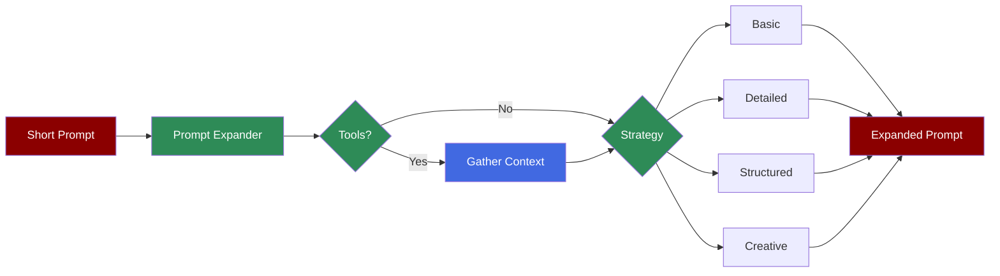

# Prompt Expander Agent



The Prompt Expander Agent transforms short, brief prompts into detailed, comprehensive prompts for better task execution. Unlike the Query Rewriter (which optimizes for search/retrieval), the Prompt Expander focuses on enriching prompts for task execution.

## Quick Start

## CLI Usage

```bash
# Expand a short prompt

praisonai "write a movie script in 3 lines" --expand-prompt

# With verbose output

praisonai "blog about AI" --expand-prompt -v

# With tools for context gathering

praisonai "latest AI trends" --expand-prompt --expand-tools tools.py

# Combine with query rewrite

praisonai "AI news" --query-rewrite --expand-prompt
```

## Expansion Strategies

## Basic Usage

```python
from praisonaiagents import PromptExpanderAgent, ExpandStrategy

# Default (AUTO strategy)

agent = PromptExpanderAgent()
result = agent.expand("write a poem")
print(result.expanded_prompt)
```

## Using Specific Strategies

```python
from praisonaiagents import PromptExpanderAgent, ExpandStrategy

agent = PromptExpanderAgent()

# Basic - minimal expansion

result = agent.expand("AI blog", strategy=ExpandStrategy.BASIC)

# Detailed - rich context and requirements

result = agent.expand("AI blog", strategy=ExpandStrategy.DETAILED)

# Structured - clear sections

result = agent.expand("AI blog", strategy=ExpandStrategy.STRUCTURED)

# Creative - vivid language

result = agent.expand("AI blog", strategy=ExpandStrategy.CREATIVE)
```

## Using Tools for Context

```python
from praisonaiagents import PromptExpanderAgent

def search_tool(query: str) -> str:
 """Search for context."""
 # Your search implementation

 return "Latest AI trends: LLMs, multimodal, agents"

agent = PromptExpanderAgent(tools=[search_tool])
result = agent.expand("write about AI trends")
print(result.expanded_prompt)
```

## Configuration Options

```python
agent = PromptExpanderAgent(
 name="PromptExpander",
 model="gpt-4o-mini",
 verbose=True,
 temperature=0.7, # Higher for creativity

 max_tokens=1000,
 tools=[...] # Optional tools for context

)
```

## ExpandResult Properties

```python
result = agent.expand("write a poem")

# Access properties

print(result.original_prompt) # Original input

print(result.expanded_prompt) # Expanded output

print(result.strategy_used) # Strategy that was used

print(result.metadata) # Additional metadata

```

## Convenience Methods

```python
agent = PromptExpanderAgent()

# Direct strategy methods

result = agent.expand_basic("short prompt")
result = agent.expand_detailed("short prompt")
result = agent.expand_structured("short prompt")
result = agent.expand_creative("short prompt")
```

## Key Difference from Query Rewriter

| Feature | Query Rewriter | Prompt Expander |
|---------|---------------|-----------------|
| **Purpose** | Optimize for search/retrieval | Expand for task execution |
| **Use Case** | RAG applications | Task prompts |
| **Output** | Search-optimized queries | Detailed action prompts |
| **CLI Flag** | `--query-rewrite` | `--expand-prompt` |

## Example: Movie Script

**Input:**
```
write a movie script in 3 lines
```

**Expanded (Creative Strategy):**
```
Craft a captivating movie script distilled into just three powerful lines,
each word infused with vivid imagery and emotional weight. Your lines should
ignite the spark of adventure and intrigue, capturing a moment that hints at
a grand journey ahead—one that resonates deeply with the audience's hearts
and imaginations. Use poignant dialogue, evocative descriptions, and a
tantalizing glimpse of conflict that will leave viewers breathless.
```