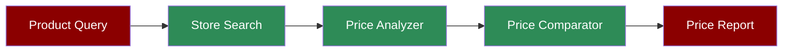

# Shopping Agent



A workflow demonstrating how the Shopping Agent can search for products, compare prices, and provide shopping recommendations.

## Quick Start

## Understanding Shopping Assistant

The Shopping Agent combines multiple capabilities for effective price comparison:
1. **Store Search**: Uses DuckDuckGo to find retailers
2. **Price Analysis**: Gathers pricing information
3. **Price Comparison**: Compares prices across stores
4. **Deal Finding**: Identifies special offers and discounts

## Features

## Example Usage

```python
# Example: Compare product prices

from praisonaiagents import Agent, Tools
from praisonaiagents.tools import duckduckgo

agent = Agent(instructions="You are a Shopping Agent", tools=[duckduckgo])
agent.start("I want to buy iPhone 16 Pro Max, check 5 stores and give me price in table")
```

## Next Steps

- Learn about [Prompt Chaining](/features/promptchaining) for complex shopping research
- Explore [Evaluator Optimizer](/features/evaluator-optimiser) for improving price accuracy
- Check out the [Research Agent](/agents/research) for detailed product research