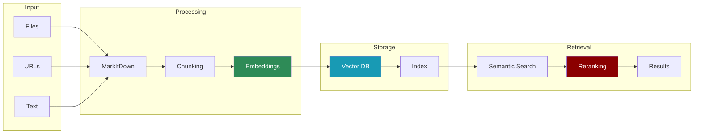

# Module praisonaiagents.knowledge

The knowledge module provides comprehensive knowledge management capabilities including document processing, vector storage, advanced chunking strategies, and semantic search functionality.

## Classes

### Knowledge

The main class for managing knowledge bases with vector storage and retrieval capabilities.

#### Parameters

- `config: Optional[Dict[str, Any]] = None` - Configuration for vector store and processing
- `verbose: int = 0` - Verbosity level (0-5+) for logging output

#### Properties

- `memory` - Returns a CustomMemory instance for knowledge storage
- `markdown` - Returns MarkItDown instance for document processing
- `chunker` - Returns a Chunking instance with configured strategy

#### Methods

- `store(content, user_id="user", agent_id=None, run_id=None, metadata=None)` - Store raw text or file content
- `add(file_path, user_id="user", agent_id=None, run_id=None, metadata=None)` - Process and add files to knowledge base
- `search(query, user_id=None, agent_id=None, run_id=None, rerank=True, **kwargs)` - Search knowledge with optional reranking
- `get(memory_id)` - Retrieve specific memory by ID
- `get_all(user_id=None, agent_id=None, run_id=None)` - Retrieve all memories with filtering
- `update(memory_id, data)` - Update existing memory
- `delete(memory_id)` - Delete specific memory
- `delete_all(user_id=None, agent_id=None, run_id=None)` - Batch delete with filtering
- `reset()` - Clear all memories
- `history(memory_id)` - Get change history for a memory

### CustomMemory

A specialized memory class that bypasses LLM usage for simple fact storage.

### Chunking

Unified interface for various text chunking strategies using the chonkie library.

#### Parameters

- `chunker_type: str = 'recursive'` - Type of chunking strategy
- `chunk_size: int = 512` - Maximum size of each chunk
- `chunk_overlap: int = 50` - Overlap between chunks
- `tokenizer: Optional[Any] = None` - Custom tokenizer (defaults to GPT-2)
- `embedding_model: Optional[Any] = None` - Embedding model for semantic chunking

#### Methods

- `chunk(text: str) → List[Chunk]` - Split text into chunks using configured strategy

## Configuration

### Vector Store Configuration

```python
config = {
 "vector_store": {
 "provider": "chroma", # Options: chroma, qdrant, pinecone

 "config": {
 "collection_name": "my_knowledge",
 "path": ".praison", # For local storage

 # Additional provider-specific options

 }
 },
 "embedder": {
 "provider": "openai",
 "config": {
 "model": "text-embedding-3-small"
 }
 }
}
```

### Chunking Strategies

#### 1. Token Chunker (`'token'`)

Splits text by token count with overlapping windows.

```python
chunker = Chunking(
 chunker_type='token',
 chunk_size=512,
 chunk_overlap=50
)
```

#### 2. Sentence Chunker (`'sentence'`)

Splits text by sentences while respecting chunk size.

```python
chunker = Chunking(
 chunker_type='sentence',
 chunk_size=512,
 chunk_overlap=50
)
```

#### 3. Recursive Chunker (`'recursive'`) - Default

Hierarchical splitting with multiple separators.

```python
chunker = Chunking(
 chunker_type='recursive',
 chunk_size=512
)
```

#### 4. Semantic Chunker (`'semantic'`)

Groups semantically similar content together.

```python
chunker = Chunking(
 chunker_type='semantic',
 chunk_size=512,
 embedding_model="sentence-transformers/all-MiniLM-L6-v2"
)
```

#### 5. SDPM Chunker (`'sdpm'`)

Semantic Double-Pass Merge for optimal chunking.

```python
chunker = Chunking(
 chunker_type='sdpm',
 chunk_size=512,
 embedding_model="sentence-transformers/all-MiniLM-L6-v2"
)
```

#### 6. Late Chunker (`'late'`)

Optimized for retrieval performance with late interaction.

```python
chunker = Chunking(
 chunker_type='late',
 chunk_size=512,
 embedding_model="sentence-transformers/all-MiniLM-L6-v2"
)
```

## Usage Examples

### Basic Knowledge Management

```python
from praisonaiagents import Knowledge

# Initialize knowledge base

knowledge = Knowledge(verbose=2)

# Add documents

knowledge.add("documents/manual.pdf")
knowledge.add("data/notes.txt")

# Store raw text

knowledge.store("Important fact: The API key is XYZ123")

# Search knowledge

results = knowledge.search("API key", limit=5)
for result in results:
 print(f"Score: {result['score']}, Content: {result['memory']}")
```

### Agent Integration

```python
from praisonaiagents import Agent

agent = Agent(
 name="Research Assistant",
 role="Knowledge expert",
 goal="Answer questions using knowledge base",
 knowledge=["research.pdf", "notes.txt"], # Files to process

 }
 }
)
```

### Advanced Configuration

```python
# Configure with custom embeddings and chunking

config = {
 "vector_store": {
 "provider": "chroma",
 "config": {
 "collection_name": "advanced_kb",
 "path": "./knowledge_store"
 }
 },
 "embedder": {
 "provider": "openai",
 "config": {
 "model": "text-embedding-3-large"
 }
 }
}

knowledge = Knowledge(config=config, verbose=3)

# Use semantic chunking for better retrieval

knowledge.chunker = Chunking(
 chunker_type='semantic',
 chunk_size=1024,
 embedding_model="BAAI/bge-small-en-v1.5"
)
```

### Scoped Knowledge Retrieval

```python
# User-specific knowledge

user_results = knowledge.search(
 "project requirements",
 user_id="user123"
)

# Agent-specific knowledge

agent_results = knowledge.search(
 "conversation history",
 agent_id="support_agent"
)

# Session-specific knowledge

session_results = knowledge.search(
 "current task",
 run_id="session_456"
)
```

## Supported File Types

* **Documents**: PDF, DOC, DOCX, PPT, PPTX, XLS, XLSX
* **Text**: TXT, MD, CSV, JSON, XML, HTML
* **Images**: JPG, PNG, GIF, BMP, SVG
* **Audio**: MP3, WAV, M4A (transcription support)
* **Archives**: ZIP (planned)

## Performance Optimization

1. **Batch Processing** - Add multiple files in one call for efficiency
2. **Chunk Size** - Larger chunks for narrative content, smaller for technical
3. **Reranking** - Disable for faster search when precision isn't critical
4. **Embedding Cache** - Reuse embeddings for duplicate content

## Best Practices

1. **Choose Appropriate Chunking** - Semantic for varied content, recursive for structured
2. **Set Meaningful Metadata** - Use metadata for filtering and organization
3. **Regular Cleanup** - Delete outdated knowledge to maintain relevance
4. **Monitor Storage** - Check vector store size for large knowledge bases
5. **Test Retrieval Quality** - Verify search results match expectations
=======
title: "Knowledge"
sidebarTitle: "Knowledge"
description: "Knowledge base management and vector storage for RAG applications"
icon: "book"
---

## Overview

The Knowledge module provides powerful knowledge base management and vector storage capabilities for building RAG (Retrieval-Augmented Generation) applications. It supports multiple file formats, various chunking strategies, and semantic search with optional reranking.



## Quick Start

## Key Concepts

## API Reference

### Constructor

```python
Knowledge(
 collection_name: str = "knowledge_base",
 storage_path: Optional[str] = None,
 chunk_size: int = 1000,
 chunk_overlap: int = 200,
 chunking_strategy: str = "recursive",
 embedding_model: str = "all-MiniLM-L6-v2",
 use_reranking: bool = False,
 reranking_model: str = "ms-marco-MiniLM-L-6-v2"
)
```

#### Parameters

### Methods

#### add()

Add content to the knowledge base from various sources.

```python
add(source: Union[str, Path]) -> bool
```

**Parameters:**
- `source` - File path, URL, or direct text content

**Returns:**
- `bool` - Success status

**Supported formats:**
- Documents: PDF, DOCX, PPTX
- Spreadsheets: XLSX, XLS, CSV
- Images: PNG, JPG, JPEG
- Web: HTML, URLs
- Text: TXT, MD, Python, JavaScript, etc.

#### search()

Search the knowledge base for relevant content.

```python
search(query: str, limit: int = 5) -> List[Dict[str, Any]]
```

**Parameters:**
- `query` - Search query
- `limit` - Maximum number of results

**Returns:**
- List of dictionaries containing:
- `text` - Content chunk
- `source` - Original source
- `score` - Relevance score
- `metadata` - Additional metadata

#### get_context()

Get formatted context for a query (useful for agents).

```python
get_context(query: str, max_results: int = 3) -> str
```

**Parameters:**
- `query` - Search query
- `max_results` - Maximum results to include

**Returns:**
- Formatted string with relevant context

#### clear()

Clear all content from the knowledge base.

```python
clear() -> None
```

#### get_stats()

Get statistics about the knowledge base.

```python
get_stats() -> Dict[str, Any]
```

**Returns:**
- Dictionary with:
- `total_chunks` - Number of stored chunks
- `sources` - List of unique sources
- `collection_name` - Name of the collection
- `storage_path` - Path to storage

## Chunking Strategies

The knowledge module supports multiple chunking strategies for different use cases:

## Integration Examples

### With Agents

```python
from praisonaiagents import Agent, Knowledge

# Create knowledge base

knowledge = Knowledge()
knowledge.add("company_handbook.pdf")
knowledge.add("product_documentation.md")

# Create agent with knowledge

agent = Agent(
 name="DocAssistant",
 role="Documentation Expert",
 goal="Answer questions using the knowledge base",
 knowledge=knowledge
)

# Agent automatically uses knowledge for responses

response = agent.chat("What is our refund policy?")
```

### RAG Application

```python
from praisonaiagents import Agent, Task, Knowledge

# Build comprehensive knowledge base

knowledge = Knowledge(
 collection_name="tech_support",
 use_reranking=True
)

# Add multiple sources

sources = [
 "troubleshooting_guide.pdf",
 "faq.md",
 "https://docs.example.com/api",
 "Common issues:\n1. Login problems\n2. Performance issues"
]

for source in sources:
 knowledge.add(source)

# Create RAG agent

rag_agent = Agent(
 name="SupportBot",
 role="Technical Support AI",
 instructions=f"""You are a helpful support agent.
 Always search the knowledge base before answering.
 Cite your sources when providing information.""",
 knowledge=knowledge
)

# Create support task

task = Task(
 description="Help user with: {query}",
 agent=rag_agent,
 expected_output="Clear solution with source citations"
)
```

### Multi-Agent Knowledge Sharing

```python
from praisonaiagents import Knowledge, Agent, PraisonAIAgents

# Shared knowledge base

shared_kb = Knowledge(collection_name="shared_research")

# Add research papers

papers = ["paper1.pdf", "paper2.pdf", "review.pdf"]
for paper in papers:
 shared_kb.add(paper)

# Create multiple agents sharing knowledge

researcher = Agent(
 name="Researcher",
 role="Research Analyst",
 knowledge=shared_kb
)

writer = Agent(
 name="Writer",
 role="Technical Writer",
 knowledge=shared_kb
)

reviewer = Agent(
 name="Reviewer",
 role="Peer Reviewer",
 knowledge=shared_kb
)

# All agents can access the same knowledge

```

### Custom Processing Pipeline

```python
from praisonaiagents import Knowledge
import logging

class CustomKnowledge(Knowledge):
 def process_before_adding(self, text: str, source: str) -> str:
 """Custom preprocessing"""
 # Clean text

 text = text.strip()

 # Add source header

 text = f"Source: {source}\n\n{text}"

 # Log processing

 logging.info(f"Processing {source}")

 return text

 def filter_search_results(self, results: list) -> list:
 """Custom result filtering"""
 # Filter out low-score results

 filtered = [r for r in results if r['score'] > 0.7]

 # Sort by score

 filtered.sort(key=lambda x: x['score'], reverse=True)

 return filtered

# Use custom knowledge

kb = CustomKnowledge(
 chunk_size=500,
 use_reranking=True
)
```

## Best Practices

## Performance Considerations

### Embedding Models

The choice of embedding model affects both quality and performance:

### Reranking Impact

```python
# Without reranking - faster

knowledge = Knowledge(use_reranking=False)
results = knowledge.search("query") # ~50ms

# With reranking - more accurate

knowledge = Knowledge(use_reranking=True)
results = knowledge.search("query") # ~200ms

```

### Scaling Considerations

For large knowledge bases:
1. **Use appropriate chunk sizes** - Larger chunks reduce total count
2. **Implement batch processing** for adding multiple documents
3. **Consider sharding** collections by domain or time period
4. **Monitor memory usage** with embedding models
5. **Use persistent storage** to avoid reprocessing

## Troubleshooting

Common issues and solutions:

## Complete Example

```python
from praisonaiagents import Knowledge, Agent, Task, PraisonAIAgents
import os

# Initialize knowledge base with optimal settings

knowledge = Knowledge(
 collection_name="customer_support",
 storage_path="./support_kb",
 chunk_size=512,
 chunk_overlap=50,
 chunking_strategy="recursive",
 use_reranking=True
)

# Add various knowledge sources

print("Building knowledge base...")

# Documentation

for doc in os.listdir("./docs"):
 if doc.endswith(('.pdf', '.md', '.txt')):
 knowledge.add(f"./docs/{doc}")
 print(f"Added: {doc}")

# FAQs from web

knowledge.add("https://example.com/faq")

# Direct knowledge

knowledge.add("""
Customer Support Best Practices:
1. Always greet customers warmly
2. Listen actively to understand the issue
3. Search knowledge base before responding
4. Provide clear, step-by-step solutions
5. Follow up to ensure resolution
""")

# Create support agent

support_agent = Agent(
 name="CustomerSupport",
 role="Senior Support Specialist",
 goal="Resolve customer issues using knowledge base",
 backstory="Expert support agent with deep product knowledge",
 knowledge=knowledge,
 verbose=True
)

# Create escalation agent

escalation_agent = Agent(
 name="EscalationSupport",
 role="Support Manager",
 goal="Handle complex issues that need escalation",
 knowledge=knowledge
)

# Define tasks

initial_support = Task(
 description="Help customer with: {customer_query}",
 agent=support_agent,
 expected_output="Solution or escalation decision"
)

escalation_task = Task(
 description="Handle escalated issue: {issue_details}",
 agent=escalation_agent,
 expected_output="Advanced solution or workaround"
)

# Create workflow

workflow = PraisonAIAgents(
 agents=[support_agent, escalation_agent],
 tasks=[initial_support, escalation_task],
 process="sequential"
)

# Test the system

test_queries = [
 "How do I reset my password?",
 "The app crashes when I upload large files",
 "Can I get a refund for my subscription?"
]

for query in test_queries:
 print(f"\nQuery: {query}")

 # Search knowledge directly

 results = knowledge.search(query, limit=3)
 print(f"Found {len(results)} relevant articles")

 # Get agent response

 response = support_agent.chat(query)
 print(f"Response: {response}")

# Get knowledge base statistics

stats = knowledge.get_stats()
print(f"\nKnowledge Base Stats:")
print(f"Total chunks: {stats['total_chunks']}")
print(f"Sources: {len(stats['sources'])}")
```