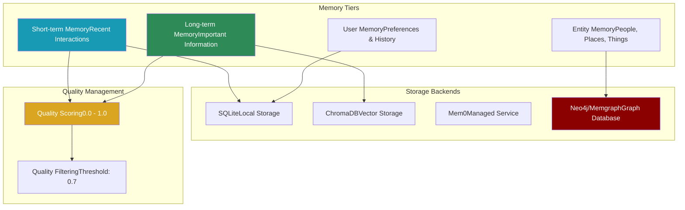

# Module praisonaiagents.memory

The memory module provides a sophisticated multi-tiered memory system with short-term, long-term, entity, and user-specific memory capabilities, including graph database support and quality scoring.

## Classes

### MemoryClient

The main class for managing agent memory with multiple storage tiers and quality-based filtering.

#### Parameters

- `config: Optional[Dict[str, Any]] = None` - Memory configuration including provider and storage settings
- `verbose: int = 0` - Verbosity level for debugging (0-5+)

#### Methods

- `create_memory(role, user_id=None)` - Create memory instance for an agent
- `store_in_short_memory(memory, user_id=None, agent_id=None)` - Store in short-term memory
- `store_in_long_memory(memory, user_id=None, agent_id=None, metadata=None, quality_score=None)` - Store in long-term memory with quality filtering
- `store_entity_memory(name, entity_type, desc, relations, user_id=None, agent_id=None)` - Store structured entity information
- `store_user_memory(memory, user_id, agent_id=None)` - Store user-specific memory
- `search_memories(query, user_id=None, agent_id=None, memory_type="all", k=3, rerank=True)` - Search across memory tiers
- `build_context_for_task(task_descr, user_id=None, additional="", max_items=3)` - Build comprehensive context
- `get_short_memories(user_id=None, agent_id=None, k=10)` - Retrieve recent short-term memories
- `get_long_memories(user_id=None, agent_id=None, k=10, min_quality=0.5)` - Retrieve quality-filtered long-term memories
- `clear_short_memory(user_id=None, agent_id=None)` - Clear short-term memory
- `clear_long_memory(user_id=None, agent_id=None)` - Clear long-term memory

### Quality Scoring Functions

#### compute_quality_score

Calculate overall quality score from individual metrics.

```python
def compute_quality_score(
 completeness: float,
 relevance: float,
 clarity: float,
 accuracy: float,
 weights: Optional[Dict[str, float]] = None
) -> float
```

#### calculate_quality_metrics

Use LLM to evaluate output quality against expectations.

```python
def calculate_quality_metrics(
 output: str,
 expected_output: str,
 llm=None,
 custom_prompt: Optional[str] = None
) -> Dict[str, float]
```

## Memory Tiers

### 1. Short-Term Memory (STM)

* **Purpose**: Immediate context and active conversation
* **Storage**: SQLite database (`.praison/short_term.db`)
* **Retention**: Ephemeral, cleared between sessions
* **Use Cases**: Current task context, recent interactions

### 2. Long-Term Memory (LTM)

* **Purpose**: Persistent knowledge across sessions
* **Storage**: SQLite + optional vector store
* **Retention**: Permanent with quality filtering
* **Use Cases**: Learned facts, important outcomes

### 3. Entity Memory

* **Purpose**: Structured information about entities
* **Storage**: Subset of LTM with special formatting
* **Format**: `Entity {name}({type}): {desc} | relationships: {relations}`
* **Use Cases**: People, organizations, locations

### 4. User Memory

* **Purpose**: User-specific preferences and history
* **Storage**: LTM with user_id filtering
* **Isolation**: Strict user separation
* **Use Cases**: Personalization, preferences

## Configuration

### Basic Configuration

```python
config = {
 "provider": "rag", # Options: rag, mem0, none

 "use_embedding": True,
 "rag_db_path": ".praison/chroma"
}
```

### Advanced Configuration with Graph Support

```python
config = {
 "provider": "mem0",
 "config": {
 "graph_store": {
 "provider": "neo4j",
 "config": {
 "url": "neo4j+s://your-instance.neo4j.io",
 "username": "neo4j",
 "password": "your-password"
 }
 },
 "vector_store": {
 "provider": "chroma",
 "config": {
 "collection_name": "agent_memory"
 }
 },
 "llm": {
 "provider": "openai",
 "config": {
 "model": "gpt-4o-mini"
 }
 }
 }
}
```

### Graph Database Options

#### Neo4j Configuration

```python
"graph_store": {
 "provider": "neo4j",
 "config": {
 "url": "neo4j+s://...",
 "username": "neo4j",
 "password": "..."
 }
}
```

#### Memgraph Configuration

```python
"graph_store": {
 "provider": "memgraph",
 "config": {
 "url": "bolt://localhost:7687",
 "username": "memgraph",
 "password": "..."
 }
=======
title: "Memory"
sidebarTitle: "Memory"
description: "Multi-tiered memory system with graph support for intelligent agents"
icon: "brain"
---

## Overview

The Memory module provides a sophisticated multi-tiered memory system that enables agents to maintain context across conversations, store and retrieve information efficiently, and even utilize graph databases for complex relationship mapping.



## Quick Start

## Configuration

### Basic Configuration

```python
memory = Memory(
 provider="rag", # Options: "rag", "mem0", "none"

 use_embedding=True,
 api_key=None, # For mem0 provider

 user_id="default_user",
 debug=False
)
```

### Advanced Configuration

```python
memory = Memory(
 # Storage paths

 rag_db_path="custom/path/chroma_db",
 short_db="custom/path/short_term.db",
 long_db="custom/path/long_term.db",
 entity_db="custom/path/entity.db",
 user_db="custom/path/user.db",

 # Graph configuration

 graph_enabled=True,
 graph_uri="bolt://localhost:7687",
 graph_user="neo4j",
 graph_password="password",

 # Quality settings

 quality_threshold=0.7,

 # Debug mode

 debug=True
)
```

## Memory Types

## API Reference

### Constructor

```python
Memory(
 provider: str = "rag",
 use_embedding: bool = True,
 api_key: Optional[str] = None,
 user_id: str = "default_user",
 rag_db_path: str = "memory_chroma_db",
 short_db: str = "short_term_memory.db",
 long_db: str = "long_term_memory.db",
 entity_db: str = "entity_memory.db",
 user_db: str = "user_memory.db",
 graph_enabled: bool = False,
 graph_uri: Optional[str] = None,
 graph_user: Optional[str] = None,
 graph_password: Optional[str] = None,
 quality_threshold: float = 0.7,
 debug: bool = False
)
```

### Core Methods

#### add()

Store information in memory with optional quality scoring.

```python
add(
 text: str,
 memory_type: str = "short",
 quality_score: Optional[float] = None,
 metadata: Optional[Dict[str, Any]] = None
) -> None
```

**Parameters:**
- `text` - Content to store
- `memory_type` - Type: "short", "long", "entity", or "user"
- `quality_score` - Quality rating (0.0-1.0, auto-calculated if None)
- `metadata` - Additional metadata

#### search()

Search across all memory types for relevant information.

```python
search(
 query: str,
 memory_type: Optional[str] = None,
 limit: int = 5
) -> List[Dict[str, Any]]
```

**Returns list of:**
```python
{
 'text': str, # Memory content

 'memory_type': str, # Type of memory

 'timestamp': str, # Creation time

 'quality_score': float, # Quality rating

 'metadata': dict # Additional data

}
```

#### update()

Update an existing memory entry.

```python
update(
 memory_id: str,
 text: str,
 memory_type: str = "short",
 quality_score: Optional[float] = None
) -> None
```

#### delete()

Delete a specific memory entry.

```python
delete(
 memory_id: str,
 memory_type: str = "short"
) -> None
```

### Context Building

#### build_context_for_task()

Build formatted context for a specific task.

```python
build_context_for_task(
 task_description: str,
 max_items: int = 10
) -> str
```

**Example output:**
```
Based on memory:
- User prefers Python for data science projects
- Previous experience with pandas and numpy
- Interested in machine learning applications
```

#### get_context()

Get all memories formatted as context.

```python
get_context(
 memory_type: Optional[str] = None,
 limit: int = 10
) -> str
```

### Quality Management

#### calculate_quality_score()

Calculate quality score for a memory entry.

```python
calculate_quality_score(
 text: str,
 memory_type: str = "short"
) -> float
```

**Scoring factors:**
- Information density
- Specificity
- Relevance indicators
- Entity mentions
- Temporal relevance

#### get_quality_memories()

Retrieve only high-quality memories.

```python
get_quality_memories(
 memory_type: str = "long",
 min_quality: float = 0.7,
 limit: int = 10
) -> List[Dict[str, Any]]
```

### Utility Methods

#### get_memories()

Retrieve raw memories from storage.

```python
get_memories(
 memory_type: str = "short",
 limit: int = 10
) -> List[Dict[str, Any]]
```

#### clear()

Clear all memories of a specific type.

```python
clear(memory_type: str = "all") -> None
```

Options: "short", "long", "entity", "user", "all"

#### get_stats()

Get memory system statistics.

```python
get_stats() -> Dict[str, Any]
```

**Returns:**
```python
{
 'total_memories': int,
 'by_type': {
 'short': int,
 'long': int,
 'entity': int,
 'user': int
 },
 'quality_distribution': dict,
 'storage_info': dict

}
```

## Usage Examples

### Basic Memory Operations

```python
from praisonaiagents.memory import MemoryClient

# Initialize memory

memory = MemoryClient(verbose=2)

# Store memories

memory.store_in_short_memory("User asked about pricing")
memory.store_in_long_memory(
 "Company pricing: $99/month for pro plan",
 quality_score=0.9
)

# Search memories

results = memory.search_memories("pricing", k=5)
```

### Quality-Based Storage

```python
from praisonaiagents.memory import calculate_quality_metrics, compute_quality_score

# Evaluate output quality

metrics = calculate_quality_metrics(
 output="Generated report content...",
 expected_output="Comprehensive analysis with data"
)

# Calculate overall score

score = compute_quality_score(
 completeness=metrics['completeness'],
 relevance=metrics['relevance'],
 clarity=metrics['clarity'],
 accuracy=metrics['accuracy']
)

# Store only high-quality outputs

if score > 0.7:
 memory.store_in_long_memory(output, quality_score=score)
```

### Entity Memory Management

```python
# Store entity information

memory.store_entity_memory(
 name="Acme Corp",
 entity_type="Company",
 desc="Leading provider of AI solutions",
 relations=["Founded by John Doe", "Partnered with TechCo"],
 user_id="user123"
)

# Retrieve entity context

context = memory.build_context_for_task(
 "Tell me about Acme Corp's partnerships"
)
```

### Agent Integration

```python
from praisonaiagents import Agent

# Agent with memory

agent = Agent(
 name="Assistant",
 role="Helpful AI assistant",
 memory=True, # Enable memory

)

# Memory is automatically managed during conversations

response = agent.chat("Remember that my favorite color is blue")
```

### Graph-Enhanced Memory

```python
# Configure with Neo4j

memory = MemoryClient({
 "provider": "mem0",
 "config": {
 "graph_store": {
 "provider": "neo4j",
 "config": {...}
 }
 }
})

# Store with relationships

memory.memory.add(
 "John Doe is the CEO of Acme Corp",

)

# Graph-aware search

results = memory.search_memories(
 "Who works at Acme Corp?",
 rerank=True
)
```

## Quality Metrics

### Completeness (0-1)

How thoroughly the content addresses the requirements.

### Relevance (0-1)

How well the content matches the expected output.

### Clarity (0-1)

How clear and well-structured the content is.

### Accuracy (0-1)

Factual correctness of the information.

### Custom Weights

```python
weights = {
 "completeness": 0.3,
 "relevance": 0.4,
 "clarity": 0.2,
 "accuracy": 0.1
}
score = compute_quality_score(**metrics, weights=weights)
```

## Best Practices

1. **Use Quality Filtering** - Set appropriate `min_quality` thresholds
2. **Scope Memories** - Use user_id and agent_id for proper isolation
3. **Regular Cleanup** - Clear short-term memory between sessions
4. **Graph for Relationships** - Use graph stores for complex entity relationships
5. **Monitor Storage** - Check database sizes periodically
6. **Test Retrieval** - Verify context building produces relevant results
=======
### Basic Memory Usage

```python
from praisonaiagents import Agent, Memory

# Create memory system

memory = Memory(user_id="user_123")

# Create agent with memory

agent = Agent(
 name="Assistant",
 role="Personal AI Assistant",
 memory=memory
)

# Conversation that builds memory

agent.chat("I prefer morning meetings")
# Automatically stored in memory

agent.chat("Schedule something for tomorrow")
# Uses memory: "Scheduling morning meeting as you prefer"

```

### Quality-Based Storage

```python
from praisonaiagents import Memory

memory = Memory(quality_threshold=0.8)

# High-quality information

memory.add(
 "User's API key: sk-abc123def456",
 memory_type="long",
 quality_score=0.9
)

# Low-quality information (won't be stored in long-term)

memory.add(
 "User said hello",
 memory_type="long",
 quality_score=0.3
)

# Get only high-quality memories

important = memory.get_quality_memories(min_quality=0.8)
```

### Graph Memory Example

```python
from praisonaiagents import Memory

# Setup graph memory

memory = Memory(
 graph_enabled=True,
 graph_uri="bolt://localhost:7687",
 graph_user="neo4j",
 graph_password="password"
)

# Store entity relationships

memory.add(
 "Alice manages Bob and Charlie at DataCorp",
 memory_type="entity"
)

memory.add(
 "DataCorp acquired SmallStartup in 2024",
 memory_type="entity"
)

# Query relationships

results = memory.search("Who does Alice manage?")
# Returns information about Bob and Charlie

results = memory.search("DataCorp acquisitions")
# Returns information about SmallStartup acquisition

```

### Multi-Agent Memory Sharing

```python
from praisonaiagents import Memory, Agent, PraisonAIAgents

# Shared memory system

shared_memory = Memory(provider="rag")

# Create agents with shared memory

researcher = Agent(
 name="Researcher",
 role="Research Analyst",
 memory=shared_memory
)

writer = Agent(
 name="Writer",
 role="Content Creator",
 memory=shared_memory
)

# Researcher stores findings

researcher.chat("Found that 73% of users prefer dark mode")

# Writer can access the same memory

response = writer.chat("Write about user preferences")
# Uses the 73% statistic from shared memory

```

## Best Practices

## Provider Comparison

## Troubleshooting

**Common Issues:**

## Advanced Configuration

### Custom Quality Scoring

```python
from praisonaiagents import Memory

class CustomMemory(Memory):
 def calculate_quality_score(self, text: str, memory_type: str) -> float:
 # Base score

 score = super().calculate_quality_score(text, memory_type)

 # Custom adjustments

 if "important" in text.lower():
 score += 0.2
 if len(text) > 200: # Favor detailed information

 score += 0.1
 if memory_type == "entity": # Boost entity memories

 score += 0.15

 return min(score, 1.0)

# Use custom memory

memory = CustomMemory(quality_threshold=0.75)
```

### Memory Middleware

```python
from praisonaiagents import Agent, Memory
from datetime import datetime

class AuditedMemory(Memory):
 def add(self, text: str, memory_type: str = "short", **kwargs):
 # Add audit metadata

 kwargs['metadata'] = kwargs.get('metadata', {})
 kwargs['metadata']['added_at'] = datetime.now().isoformat()
 kwargs['metadata']['source'] = 'agent_conversation'

 # Log addition

 print(f"[AUDIT] Adding {memory_type} memory: {text[:50]}...")

 super().add(text, memory_type, **kwargs)

# Use with agents

memory = AuditedMemory()
agent = Agent(name="Audited", memory=memory)
```

## Summary

The Memory module provides a comprehensive solution for agent memory management:

✅ **Multi-tiered Architecture** - Different memory types for different needs
✅ **Quality Management** - Automatic scoring and filtering
✅ **Graph Support** - Complex relationship mapping with Neo4j/Memgraph
✅ **Flexible Storage** - Multiple backend options
✅ **Context Building** - Automatic context generation for tasks

Perfect for building agents that:
- Maintain conversation context
- Remember user preferences
- Track entity relationships
- Build knowledge over time