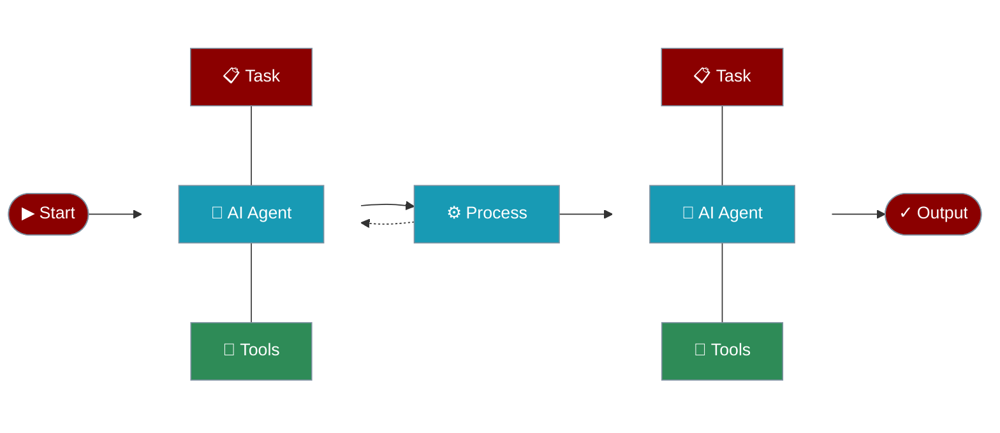

# Understanding Agents

Agents are the core building blocks of PraisonAI. Each agent is an autonomous AI entity with specific roles, goals, and capabilities.



## Key Components

## Component Details

### Role and Goal

| Component | Description | Example |
|:----------|:------------|:--------|
| **Role** | Agent's function and expertise | Research Analyst, Code Developer |
| **Goal** | Specific objectives to achieve | Analyze market trends, Generate reports |
| **Backstory** | Contextual background | Expert with 10 years of experience |

### Capabilities

## Agent Types

## Best Practices

## Async Capabilities

## Advanced Features

## Async Support

Agents now support asynchronous operations through the following methods:
- `achat`: Async version of the chat method
- `astart`: Async version of start method
- `aexecute_task`: Async version of execute_task method
- `arun_task`: Async version of run_task method
- `arun_all_tasks`: Async version of run_all_tasks method

### Example Usage:

```python
import asyncio
from praisonaiagents import Agent, Task, PraisonAIAgents

async def main():
 # Create an async agent

 async_agent = Agent(
 name="AsyncAgent",
 role="Async Task Specialist",
 goal="Perform async operations",
 backstory="Expert in async operations",
 tools=[async_search_tool], # Your async tool

 verbose=True
 )

 # Create an async task

 async_task = Task(
 description="Perform async operation",
 expected_output="Async result",
 agent=async_agent,
 async_execution=True # Enable async execution

 )

 # Create and start agents with async support

 agents = PraisonAIAgents(
 agents=[async_agent],
 tasks=[async_task],
 verbose=True
 )

 # Start async execution

 result = await agents.astart()
 print(result)

# Run the async main function

if __name__ == "__main__":
 asyncio.run(main())
```

### Key Features:

- Full async/await support
- Parallel task execution
- Async tool integration
- Async callback support
- Mixed sync/async operations

## Next Steps