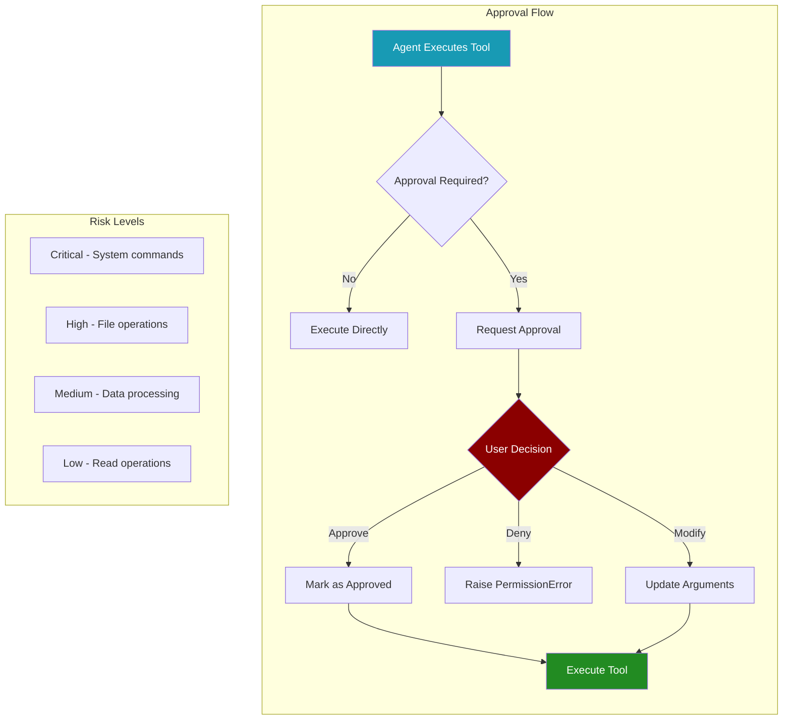

# Human Approval System



## Overview

The Human Approval System provides a minimal yet powerful human-in-the-loop framework for dangerous tool operations in PraisonAI Agents. It extends the existing callback system to require human approval before executing high-risk tools, ensuring safety and control over critical operations.

## Quick Start

## Core Concepts

### Risk Levels

The approval system categorises tools into four risk levels:

### Approval Flow Lifecycle

1. **Tool Execution Request**: Agent attempts to execute a tool
2. **Approval Check**: System checks if tool requires approval
3. **Context Verification**: Checks if already approved in current context
4. **User Prompt**: Displays tool details and requests approval
5. **Decision Processing**: Handles approval, denial, or modification
6. **Execution**: Tool executes with approved parameters

## API Reference

### Decorators

#### `@require_approval`

Decorator to mark a tool as requiring human approval.

```python
@require_approval(risk_level: RiskLevel = "high")
```

**Parameters:**
- `risk_level`: Risk level of the tool ("critical", "high", "medium", "low")

**Example:**
```python
@require_approval(risk_level="critical")
def execute_system_command(cmd: str) -> str:
 """Execute a system command"""
 return subprocess.check_output(cmd, shell=True).decode()
```

### Classes

#### `ApprovalDecision`

Result of an approval request.

```python
ApprovalDecision(
 approved: bool,
 modified_args: Optional[Dict[str, Any]] = None,
 reason: str = ""
)
```

**Attributes:**
- `approved`: Whether the operation was approved
- `modified_args`: Modified arguments to merge with original
- `reason`: Reason for approval/denial

### Functions

#### `set_approval_callback`

Set a custom approval callback function.

```python
set_approval_callback(callback_fn: Callable) -> None
```

**Parameters:**
- `callback_fn`: Function that accepts (function_name, arguments, risk_level) and returns ApprovalDecision

#### `add_approval_requirement`

Dynamically add approval requirement for a tool.

```python
add_approval_requirement(
 tool_name: str,
 risk_level: RiskLevel = "high"
) -> None
```

#### `remove_approval_requirement`

Remove approval requirement for a tool.

```python
remove_approval_requirement(tool_name: str) -> None
```

#### `is_approval_required`

Check if a tool requires approval.

```python
is_approval_required(tool_name: str) -> bool
```

## Usage Examples

### Basic Usage with Default Console Approval

### Custom Approval Callback

### Async Support

### Runtime Configuration

## Integration with Agents

### Automatic Integration

The approval system automatically integrates with any tool used by agents:
1. **Tool Detection**: When an agent attempts to use a tool, the system checks if approval is required
2. **Context Management**: Approved tools are tracked per execution context
3. **Seamless Flow**: Agents continue execution after approval without additional configuration

### Best Practices

## Advanced Features

### Context-Aware Approvals

The system tracks approved operations within execution contexts:

```python
from praisonaiagents.approval import mark_approved, is_already_approved

# Manually mark a tool as approved in current context

mark_approved("write_file")

# Check if tool is already approved

if is_already_approved("write_file"):
 print("Tool already approved in this context")
```

### Approval Context Management

```python
from praisonaiagents.approval import clear_approval_context

# Clear all approvals in current context

clear_approval_context()

# Useful for:

# - Starting fresh approval sessions

# - Resetting after errors

# - Testing approval flows

```

### Default Dangerous Tools

The system comes with pre-configured dangerous tools:

## Console Approval Interface

The default console approval interface provides:

Features:
- Colour-coded risk levels
- Clear parameter display
- Truncation of long values
- Keyboard interrupt handling
- Rich formatting with panels

## Error Handling

The approval system handles various error scenarios:

## Security Considerations

## Summary

The Human Approval System provides essential safety controls for PraisonAI Agents:

✅ **Flexible Risk Management** - Categorise and control tools by risk level
✅ **Seamless Integration** - Works automatically with existing agents and tools
✅ **Customisable Callbacks** - Implement custom approval logic and policies
✅ **Async Support** - Full support for asynchronous operations
✅ **Runtime Configuration** - Dynamically adjust approval requirements

Use this system whenever agents interact with:
- System commands and shell operations
- File system modifications
- Database operations
- External APIs with side effects
- Any potentially dangerous operations