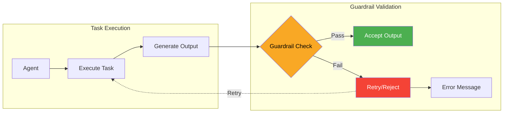

# Guardrails

## Overview

Guardrails provide a powerful validation and quality assurance layer for task outputs in PraisonAI. They allow you to define validation criteria that are checked against task results, ensuring outputs meet specific requirements before being accepted.



## Types of Guardrails

## Quick Start

## API Reference

### GuardrailResult

The return type for guardrail validation functions.

```python
class GuardrailResult:
 is_valid: bool # Whether the output passed validation

 message: str # Explanation of the validation result

```

### LLMGuardrail

Creates an LLM-based guardrail for natural language validation.

```python
LLMGuardrail(
 criteria: str, # Natural language validation criteria

 llm_model: str = "gpt-4", # LLM model to use

 temperature: float = 0.1, # Low temperature for consistency

 max_tokens: int = 100 # Token limit for response

)
```

### Task Parameters

Configure guardrails on tasks:

```python
Task(
 description: str,
 agent: Agent,
 guardrail: Union[Callable, LLMGuardrail, None] = None,
 max_retry: int = 3, # Max retries if guardrail fails

 expected_output: str = None
)
```

## Implementation Examples

### Basic Validation

```python
def validate_email_format(output: str) -> GuardrailResult:
 """Ensure output contains valid email addresses"""
 import re
 email_pattern = r'\b[A-Za-z0-9._%+-]+@[A-Za-z0-9.-]+\.[A-Z|a-z]{2,}\b'

 if re.search(email_pattern, output):
 return GuardrailResult(
 is_valid=True,
 message="Valid email found in output"
 )
 else:
 return GuardrailResult(
 is_valid=False,
 message="Output must contain at least one valid email address"
 )

# Use with task

task = Task(
 description="Extract contact emails from the document",
 agent=data_agent,
 guardrail=validate_email_format
)
```

### Complex Structure Validation

```python
def validate_json_structure(output: str) -> GuardrailResult:
 """Validate JSON output has required fields"""
 import json

 try:
 data = json.loads(output)
 required_fields = ["title", "summary", "tags", "date"]

 missing = [f for f in required_fields if f not in data]
 if missing:
 return GuardrailResult(
 is_valid=False,
 message=f"Missing required fields: {', '.join(missing)}"
 )

 if not isinstance(data.get("tags"), list):
 return GuardrailResult(
 is_valid=False,
 message="'tags' must be a list"
 )

 return GuardrailResult(
 is_valid=True,
 message="JSON structure is valid"
 )

 except json.JSONDecodeError as e:
 return GuardrailResult(
 is_valid=False,
 message=f"Invalid JSON: {str(e)}"
 )
```

### LLM-based Content Validation

```python
# Create sophisticated content guardrail

content_guardrail = LLMGuardrail(
 criteria="""
 Evaluate the output based on:
1. Accuracy: Information should be factually correct
2. Completeness: All requested points should be addressed
3. Clarity: Language should be clear and unambiguous
4. Tone: Professional but approachable
5. Structure: Well-organized with clear sections

 The output should NOT contain:
- Personal opinions presented as facts
- Promotional language or bias
- Technical jargon without explanation
- Grammatical or spelling errors

 Rate as VALID only if all criteria are met.
 """,
 llm_model="gpt-4",
 temperature=0.1
)

# Apply to content generation task

task = Task(
 description="Write a technical blog post about cloud computing",
 agent=writer_agent,
 guardrail=content_guardrail,
 max_retry=2
)
```

### Output Modification Guardrails

```python
def sanitize_pii(output: str) -> GuardrailResult:
 """Remove personally identifiable information"""
 import re

 # Check for PII patterns

 ssn_pattern = r'\b\d{3}-\d{2}-\d{4}\b'
 if re.search(ssn_pattern, output):
 # Modify output to remove PII

 sanitized = re.sub(ssn_pattern, '[SSN-REDACTED]', output)
 return GuardrailResult(
 is_valid=True,
 message=f"PII removed. Modified output: {sanitized}"
 )

 return GuardrailResult(
 is_valid=True,
 message="No PII detected"
 )
```

## Creating an Implementation Guide

### Step 1: Identify Validation Needs

Determine what aspects of the output need validation:
- Format requirements (JSON, XML, Markdown)
- Content requirements (specific information, tone)
- Security concerns (no sensitive data, safe content)
- Business rules (pricing limits, compliance)

### Step 2: Choose Guardrail Type

### Step 3: Implement Guardrails

```python
from praisonaiagents import Agent, Task, GuardrailResult, LLMGuardrail

# Example: E-commerce product description validation

def validate_product_description(output: str) -> GuardrailResult:
 """Validate product descriptions meet requirements"""

 # Check minimum length

 if len(output) GuardrailResult:
 """Ensure output is valid CSV with required columns"""
 import csv
 import io

 try:
 reader = csv.DictReader(io.StringIO(output))
 required_columns = ["name", "email", "phone", "address"]

 if not all(col in reader.fieldnames for col in required_columns):
 return GuardrailResult(
 is_valid=False,
 message=f"Missing columns. Required: {required_columns}"
 )

 return GuardrailResult(is_valid=True, message="Valid CSV format")

 except Exception as e:
 return GuardrailResult(
 is_valid=False,
 message=f"Invalid CSV: {str(e)}"
 )
```

### Compliance Checking

```python
compliance_guardrail = LLMGuardrail(
 criteria="""
 Verify the output complies with GDPR requirements:
1. Includes privacy policy reference
2. Mentions data retention period
3. Explains user rights (access, deletion, portability)
4. Identifies data controller
5. No unnecessary personal data collection
 """
)
```

### Quality Control

```python
def validate_code_quality(output: str) -> GuardrailResult:
 """Check generated code meets quality standards"""

 # Check for common issues

 if "eval(" in output or "exec(" in output:
 return GuardrailResult(
 is_valid=False,
 message="Unsafe functions (eval/exec) detected"
 )

 # Check indentation

 lines = output.split('\n')
 if any(line.startswith(' ') and len(line) - len(line.lstrip()) % 4 != 0
 for line in lines):
 return GuardrailResult(
 is_valid=False,
 message="Inconsistent indentation (use 4 spaces)"
 )

 return GuardrailResult(
 is_valid=True,
 message="Code meets quality standards"
 )
```

## Real-world Example

### Financial Report Validation

```python
from praisonaiagents import Agent, Task, PraisonAIAgents, GuardrailResult, LLMGuardrail
import json
import re

def validate_financial_report(output: str) -> GuardrailResult:
 """Validate financial report structure and calculations"""
 try:
 report = json.loads(output)

 # Check required sections

 required_sections = ["revenue", "expenses", "profit", "summary"]
 missing = [s for s in required_sections if s not in report]
 if missing:
 return GuardrailResult(
 is_valid=False,
 message=f"Missing sections: {missing}"
 )

 # Validate calculations

 revenue = report.get("revenue", {}).get("total", 0)
 expenses = report.get("expenses", {}).get("total", 0)
 stated_profit = report.get("profit", {}).get("total", 0)
 calculated_profit = revenue - expenses

 if abs(stated_profit - calculated_profit) > 0.01:
 return GuardrailResult(
 is_valid=False,
 message=f"Profit calculation error: stated {stated_profit}, should be {calculated_profit}"
 )

 # Check for negative values where inappropriate

 if revenue < 0:
 return GuardrailResult(
 is_valid=False,
 message="Revenue cannot be negative"
 )

 return GuardrailResult(
 is_valid=True,
 message="Financial report validated successfully"
 )

 except Exception as e:
 return GuardrailResult(
 is_valid=False,
 message=f"Report validation error: {str(e)}"
 )

# LLM guardrail for report quality

report_quality_guardrail = LLMGuardrail(
 criteria="""
 Evaluate the financial report for:
1. Clear executive summary with key insights
2. Proper context for all numbers (YoY growth, percentages)
3. Risk factors and mitigation strategies mentioned
4. Future outlook based on current trends
5. Professional language appropriate for stakeholders
6. No speculation presented as fact
 """
)

# Create workflow

analyst = Agent(
 name="FinancialAnalyst",
 role="Senior Financial Analyst",
 goal="Create accurate financial reports"
)

# Multi-step validation

generate_report = Task(
 description="Generate Q4 financial report from data",
 agent=analyst,
 guardrail=validate_financial_report, # Structural validation

 max_retry=2
)

enhance_report = Task(
 description="Add analysis and insights to the report",
 agent=analyst,
 guardrail=report_quality_guardrail, # Quality validation

 context=[generate_report]
)

# Execute workflow

workflow = PraisonAIAgents(
 agents=[analyst],
 tasks=[generate_report, enhance_report]
)

result = workflow.start()
```

## Summary

Guardrails in PraisonAI provide:

✅ **Output Validation** - Ensure task outputs meet specific criteria
✅ **Quality Assurance** - Maintain consistent quality standards
✅ **Error Prevention** - Catch issues before they propagate
✅ **Flexible Implementation** - Use functions or LLMs for validation
✅ **Automatic Retries** - Built-in retry mechanism for failed validations

Use guardrails whenever you need:
- Structured output validation
- Content quality checks
- Compliance verification
- Security and safety checks
- Business rule enforcement