# Agent Handoff System

The handoff system enables seamless task delegation between specialised agents, allowing complex workflows where each agent contributes their expertise.

```mermaid
graph LR
 User([👤 User]) --> TriageAgent[🤖 Triage Agent]
 TriageAgent --> BillingAgent[💳 Billing Agent]
 TriageAgent --> TechAgent[🛠️ Technical Agent]
 TriageAgent --> RefundAgent[💰 Refund Agent]
 BillingAgent --> EscalationAgent[📞 Escalation Agent]
 TechAgent --> EscalationAgent
 RefundAgent --> EscalationAgent

 classDef input fill:#8B0000,stroke:#7C90A0,color:#fff
 classDef process fill:#189AB4,stroke:#7C90A0,color:#fff
 classDef specialist fill:#2E8B57,stroke:#7C90A0,color:#fff

 class User input
 class TriageAgent process
 class BillingAgent,TechAgent,RefundAgent specialist
 class EscalationAgent input
```



## Key Concepts

## Quick Start

## Handoff Configuration

### Basic Parameters

| Parameter | Type | Description | Default |
|-----------|------|-------------|---------|
| `agent` | Agent | Target agent for handoff | Required |
| `tool_name_override` | str | Custom name for handoff tool | `transfer_to_` |
| `tool_description_override` | str | Custom description | Auto-generated |
| `on_handoff` | Callable | Callback function | None |
| `input_filter` | Callable | Filter for conversation data | None |

### Handoff Filters

## Advanced Features

### Structured Input Types

Use Pydantic models for typed handoff data:

```python
from pydantic import BaseModel

class EscalationData(BaseModel):
 reason: str
 priority: str
 customer_id: str

escalation = handoff(
 escalation_agent,
 input_type=EscalationData,
 tool_description_override="Escalate to senior management with structured data"
)
```

### Callback Patterns

## Complete Example

## Best Practices

## Integration with Agent Instructions

The handoff system automatically enhances agent prompts:

```python
# Automatic prompt enhancement

agent = Agent(
 name="Support Agent",
 instructions="You help customers with their issues.",
 handoffs=[billing_agent, tech_agent]
)

# The system adds:

# "You have the ability to transfer conversations to:

# - Billing Specialist for billing issues

# - Technical Support for technical problems"

```

## Next Steps