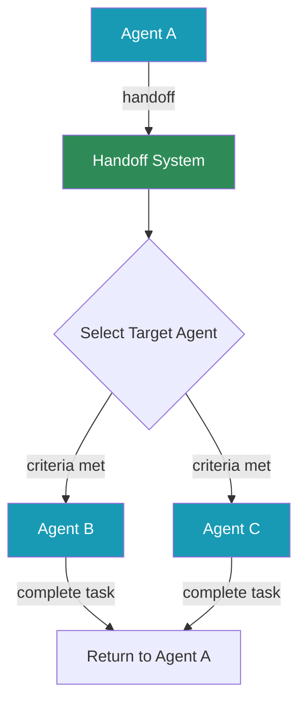

# Agent Handoffs



## Overview

Agent handoffs enable seamless task delegation between agents in PraisonAI. When an agent encounters a task outside its expertise, it can dynamically hand off the conversation to a more suitable agent, ensuring optimal task completion.

## Quick Start

## How Handoffs Work

### 1. **Handoff Detection**

Agents identify when they need to delegate based on:
- Task complexity beyond their expertise
- Specific keywords or patterns in user requests
- Explicit handoff instructions in their role

### 2. **Target Selection**

The system selects the best agent using:
- Predefined handoff targets in agent configuration
- Dynamic selection based on agent capabilities
- Custom selection logic via callbacks

### 3. **Context Transfer**

When handing off, the system:
- Packages the entire conversation history
- Includes any relevant metadata
- Maintains user context and preferences

### 4. **Seamless Continuation**

The receiving agent:
- Gets full context of the conversation
- Continues naturally without user intervention
- Can hand back or to another agent if needed

## Basic Usage

### Simple Handoff Configuration

```python
from praisonaiagents import Agent

# Agent with specific handoff targets

receptionist = Agent(
 name="Receptionist",
 role="Virtual Receptionist",
 goal="Route inquiries to appropriate departments",
 backstory="You are a helpful receptionist who directs people to the right specialist.",
 handoffs=["Sales", "Support", "HR"]
)

# Specialist agents

sales = Agent(
 name="Sales",
 role="Sales Representative",
 goal="Help customers with purchases and product information"
)

support = Agent(
 name="Support",
 role="Support Specialist",
 goal="Resolve technical issues and answer questions"
)
```

### Using the Handoff Tool

```python
from praisonaiagents import Agent, handoff

agent = Agent(
 name="Assistant",
 instructions="You are a general assistant. Use handoff for specialized tasks.",
 tools=[handoff] # Provide handoff as a tool

)

# The agent can now use handoff() function when needed

response = agent.chat("I need help with a complex math problem")
# Agent may call: handoff(agent="MathExpert", message="User needs help with complex math")

```

## Advanced Usage

### Custom Handoff Names

```python
from praisonaiagents import Agent, handoff

# Create handoff with custom name

transfer_to_human = handoff(
 name="transfer_to_human",
 description="Transfer the conversation to a human agent when the user requests it"
)

chatbot = Agent(
 name="Chatbot",
 instructions="You are an AI assistant. Transfer to human when requested.",
 tools=[transfer_to_human]
)
```

### Handoff Callbacks

```python
def on_handoff(from_agent, to_agent, context):
 """Custom logic when handoff occurs"""
 print(f"Handoff: {from_agent} -> {to_agent}")
 # Log the handoff

 # Update metrics

 # Send notifications

 return True # Allow handoff to proceed

agent = Agent(
 name="Agent",
 handoffs=["Specialist"],
 handoff_callback=on_handoff
)
```

### Structured Input with Pydantic

```python
from pydantic import BaseModel
from praisonaiagents import handoff, Agent

class CustomerInfo(BaseModel):
 name: str
 account_id: str
 issue_type: str
 priority: int

structured_handoff = handoff(
 input_model=CustomerInfo,
 description="Handoff with structured customer information"
)

agent = Agent(
 name="Intake",
 tools=[structured_handoff]
)
```

## Handoff Filters

Control which agents can receive handoffs using filters:

```python
from praisonaiagents.agent.handoff import handoff_filters

# Default filters available

filters = handoff_filters()
# Returns: ["all", "none", "self", "other", "team:"]

# Use in agent configuration

agent = Agent(
 name="TeamLead",
 handoff_filter="team:support", # Only handoff to support team

 handoffs=["Agent1", "Agent2", "Agent3"]
)

# Filter examples:

# "all" - Can receive from any agent (default)

# "none" - Cannot receive handoffs

# "self" - Can only receive from itself

# "other" - Can receive from any agent except itself

# "team:xyz" - Can only receive from agents in team 'xyz'

```

## Integration Patterns

### Multi-Agent Workflow with Handoffs

```python
from praisonaiagents import Agent, Task, PraisonAIAgents

# Create interconnected agents

coordinator = Agent(
 name="Coordinator",
 role="Workflow Coordinator",
 handoffs=["Researcher", "Writer", "Reviewer"]
)

researcher = Agent(
 name="Researcher",
 role="Research Specialist",
 handoffs=["Coordinator", "Writer"]
)

writer = Agent(
 name="Writer",
 role="Content Writer",
 handoffs=["Coordinator", "Reviewer"]
)

# Create workflow

workflow = PraisonAIAgents(
 agents=[coordinator, researcher, writer],
 process="sequential",
 memory=True
)
```

### Conditional Handoffs

```python
def should_handoff(message: str) -> str:
 """Determine which agent to handoff to based on message content"""
 if "technical" in message.lower():
 return "TechSupport"
 elif "billing" in message.lower():
 return "Billing"
 elif "urgent" in message.lower():
 return "PrioritySupport"
 return None

agent = Agent(
 name="Router",
 instructions='''
 Analyze user messages and route to appropriate specialists.
 Use the should_handoff function to determine routing.
 ''',
 tools=[should_handoff, handoff]
)
```

## Best Practices

## Common Use Cases

### Customer Support System

```python
# Tiered support system with automatic escalation

l1_support = Agent(
 name="L1Support",
 role="Level 1 Support",
 instructions="Handle basic queries. Escalate complex issues to L2.",
 handoffs=["L2Support"]
)

l2_support = Agent(
 name="L2Support",
 role="Level 2 Support",
 instructions="Handle complex technical issues. Escalate critical issues to L3.",
 handoffs=["L3Support", "L1Support"]
)

l3_support = Agent(
 name="L3Support",
 role="Level 3 Support",
 instructions="Handle critical and escalated issues.",
 handoffs=["Engineering", "L2Support"]
)
```

### Specialized Department Routing

```python
# Multi-department organization

reception = Agent(
 name="Reception",
 role="Virtual Receptionist",
 handoffs=["Sales", "Support", "HR", "Finance", "Legal"]
)

# Each department can hand back to reception or to other departments

sales = Agent(
 name="Sales",
 role="Sales Department",
 handoffs=["Reception", "Finance", "Support"]
)
```

### Language-Based Routing

```python
# Multilingual support system

language_detector = Agent(
 name="LanguageRouter",
 role="Language Detection and Routing",
 instructions="Detect user language and route to appropriate agent.",
 handoffs=["EnglishSupport", "SpanishSupport", "FrenchSupport"]
)
```

## API Reference

See the [Handoff API documentation](/api/praisonaiagents/agent/handoff) for detailed information about:
- The `Handoff` class
- The `handoff()` function
- `HandoffInputData` structure
- Built-in handoff filters
- Callback signatures

## Troubleshooting

Common issues and solutions:

## Summary

Agent handoffs in PraisonAI enable:
- ✅ Dynamic task delegation between specialized agents
- ✅ Seamless context preservation across transfers
- ✅ Flexible routing with filters and callbacks
- ✅ Building sophisticated multi-agent workflows

Use handoffs to create more capable and specialized agent systems that can handle complex, multi-domain tasks efficiently.