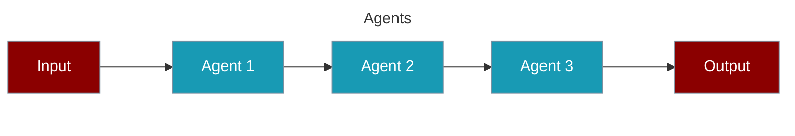
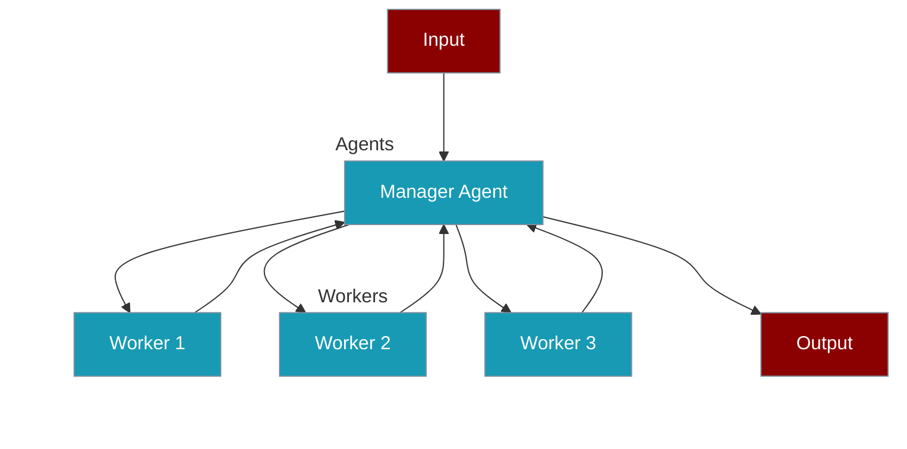
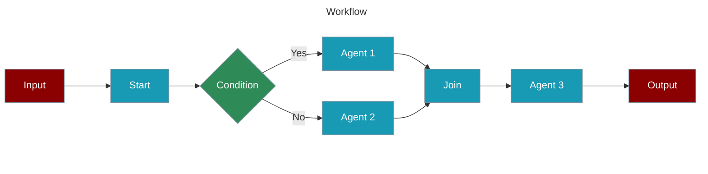

# Understanding Process Types

Process types in PraisonAI define how tasks are executed and how agents collaborate. Each process type offers different patterns for task execution and agent coordination.

## Process Types Overview

## Sequential Process

The simplest form of task execution where tasks are performed one after another.

## Hierarchical Process

Uses a manager agent to coordinate task execution and agent assignments.

## Workflow Process

Advanced process type supporting complex task relationships and conditional execution.

## Getting Started

## Advanced Features

## Async Processing

### Core Async Methods

### Process-Specific Features

### Key Benefits