# Understanding Tasks

Tasks are units of work that agents execute. Each task has a clear goal, input requirements, and expected outputs.


## Core Components

## Task Configuration

# Understanding Tasks





```mermaid
graph LR
 %% Task Flow Steps
 Start([▶ Start]) --> TaskDef
 TaskDef --> AgentAssign
 AgentAssign --> Exec
 Exec --> Output([✓ Output])

 %% Define subgraphs for each step
 subgraph TaskDef[" "]
 TD_Icon[📋 Task Definition]
 TD_Desc[Description & Requirements]

 TD_Icon --- TD_Desc

 style TD_Icon fill:#2D3047,stroke:#7C90A0,color:#fff
 style TD_Desc fill:#5C80BC,stroke:#7C90A0,color:#fff
 end

 subgraph AgentAssign[" "]
 AA_Icon[🤖 Agent Assignment]
 AA_Desc[Matching & Delegation]

 AA_Icon --- AA_Desc

 style AA_Icon fill:#2D3047,stroke:#7C90A0,color:#fff
 style AA_Desc fill:#5C80BC,stroke:#7C90A0,color:#fff
 end

 subgraph Exec[" "]
 E_Icon[⚙️ Execution]
 E_Desc[Processing & Tools]

 E_Icon --- E_Desc

 style E_Icon fill:#2D3047,stroke:#7C90A0,color:#fff
 style E_Desc fill:#5C80BC,stroke:#7C90A0,color:#fff
 end

 %% Styling for main elements
 style Start fill:#2D3047,stroke:#7C90A0,color:#fff
 style Output fill:#2D3047,stroke:#7C90A0,color:#fff

 %% Style for containers
 style TaskDef fill:#1B1F3B,stroke:#7C90A0,color:#fff
 style AgentAssign fill:#1B1F3B,stroke:#7C90A0,color:#fff
 style Exec fill:#1B1F3B,stroke:#7C90A0,color:#fff

 %% Global styles
 classDef default fill:#2D3047,stroke:#7C90A0,color:#fff
 linkStyle default stroke:#7C90A0,stroke-width:2px
```

```mermaid
graph LR
 %% Task States
 Pending([📥 Pending]) --> InProgress([⚡ In Progress])
 InProgress --> Completed([✅ Completed])
 InProgress --> Failed([❌ Failed])

 %% Styling
 style Pending fill:#2D3047,stroke:#7C90A0,color:#fff
 style InProgress fill:#5C80BC,stroke:#7C90A0,color:#fff
 style Completed fill:#2D3047,stroke:#7C90A0,color:#fff
 style Failed fill:#2D3047,stroke:#7C90A0,color:#fff

 %% Global styles
 classDef default fill:#2D3047,stroke:#7C90A0,color:#fff
 linkStyle default stroke:#7C90A0,stroke-width:2px
```

## Task Types

## Task Relationships

### Context Sharing

```python
task_a = Task(name="research")
task_b = Task(
 name="analyze",
 context=[task_a] # Uses task_a's output

)
```

### Task Dependencies

| Relationship | Description | Example |
|:-------------|:------------|:--------|
| **Sequential** | Tasks run one after another | Research → Analysis → Report |
| **Parallel** | Independent tasks run simultaneously | Data Collection + Processing |
| **Conditional** | Tasks depend on previous results | Success → Next Task, Failure → Retry |

## Advanced Features

## Getting Started

## Best Practices

## Async Task Execution

## Next Steps