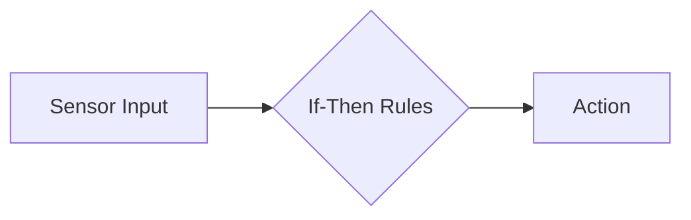

# Types of AI Agents

AI agents come in different forms, each designed for specific purposes and with varying levels of complexity. Understanding these types will help you choose the right approach for your needs.

## Simple Reflex Agents

These are the most basic type of AI agents that operate using simple if-then rules.

**Real-world example**: A basic thermostat that turns heating on when temperature drops below a set point.

## Model-Based Agents

These agents maintain an internal model of their environment to make better decisions.

**Real-world example**: A GPS navigation system that models roads and traffic conditions.

## Goal-Based Agents

These agents make decisions based on how their actions will help achieve specific goals.

**Real-world example**: A chess-playing AI that plans moves to achieve checkmate.

## Utility-Based Agents

These agents choose actions that maximize a specific utility (or happiness) function.

**Real-world example**: An investment robo-advisor that balances risk and return.

## Learning Agents

These agents improve their performance over time through experience.

**Real-world example**: Recommendation systems that learn your preferences over time.

## Understanding Agent Complexity

## Which Agent Type Should You Build?

The best type of agent for your project depends on:
1. **The problem complexity**: Simple problems may only need reflex agents
2. **Available data**: Learning agents need training data
3. **Required adaptability**: Will your agent need to adapt to new situations?
4. **Available resources**: More complex agents require more computational power

In this course, we'll focus primarily on goal-based and simple learning agents as they provide a good balance of capability and complexity for beginners.