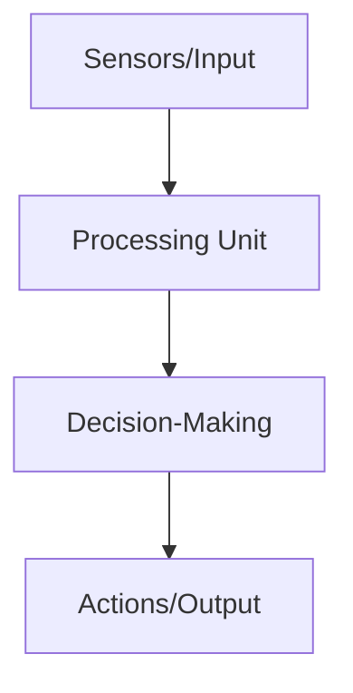
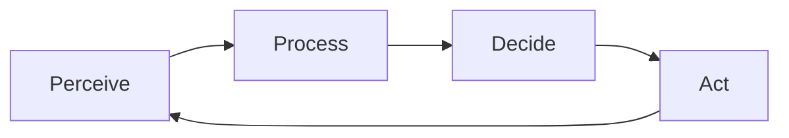
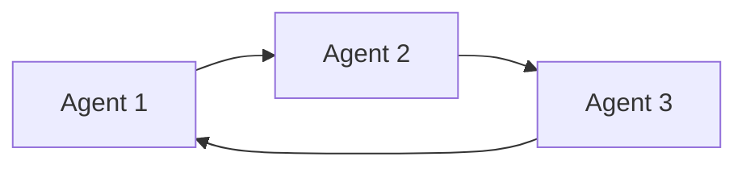

# Agent Architecture

Understanding how AI agents are structured will help you build more effective agents. This lesson covers the fundamental components of an agent's architecture.

## Basic Components of an AI Agent

Every AI agent, regardless of complexity, has these basic components:



### 1. Input (Sensors)

This is how agents receive information from their environment.

### 2. Processing Unit

This component processes information and converts it into a format the agent can understand.

### 3. Decision-Making Core

The "brain" of the agent that determines what actions to take.

### 4. Output (Actions)

The actions the agent can perform to achieve its goals.

## The Agent Loop

Agents operate in a continuous loop:



This cycle allows agents to continuously:
1. Gather information
2. Update their understanding
3. Make new decisions
4. Take appropriate actions

## PraisonAI Agent Architecture

In the PraisonAI framework, agents follow a specific architecture:

### Simple Agent Structure

```python
from praisonaiagents import Agent

# Create a simple agent

research_agent = Agent(
 instructions="Research the latest developments in renewable energy",
 name="ResearchAgent"
)

# Start the agent

research_agent.start()
```

## Understanding Agent Communication

Multi-agent systems allow agents to communicate with each other:



Each agent can:
- Pass information to other agents
- Request assistance from specialized agents
- Collaborate on complex tasks

## Key Takeaways

In the next lesson, we'll explore how to define effective instructions for your AI agents.