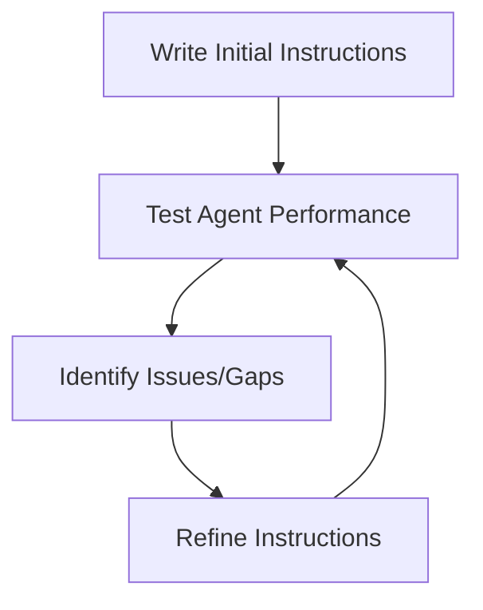

# Creating Effective Agent Instructions

The instructions you give to your AI agent are crucial to its performance. Well-crafted instructions lead to agents that understand their purpose and execute tasks effectively.

## Why Instructions Matter

Instructions serve as the agent's "job description" and guide its behavior:

## Elements of Effective Instructions

### 1. Role Definition

Tell the agent who it is and what its expertise should be.

### 2. Purpose and Goals

Clearly state what the agent should accomplish.

### 3. Process Guidelines

Explain how the agent should approach tasks.

### 4. Response Format

Specify how you want information presented.

## Instructions Template

Here's a template you can use to create effective agent instructions:

```
You are a [ROLE] specializing in [EXPERTISE AREAS].

Your goal is to [MAIN OBJECTIVE].

When approaching tasks:
1. [FIRST STEP/APPROACH]
2. [SECOND STEP/APPROACH]
3. [THIRD STEP/APPROACH]

Present your results in [FORMAT PREFERENCES].

Additional guidelines:
- [SPECIFIC BEHAVIOR 1]
- [SPECIFIC BEHAVIOR 2]
- [SPECIFIC BEHAVIOR 3]
```

## Examples in PraisonAI

Let's look at how instructions are implemented in PraisonAI:

## Common Instruction Mistakes

## Refining Your Instructions

Effective instruction improvement follows this cycle:



In the next lesson, we'll explore how agents use tools to extend their capabilities.