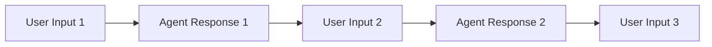
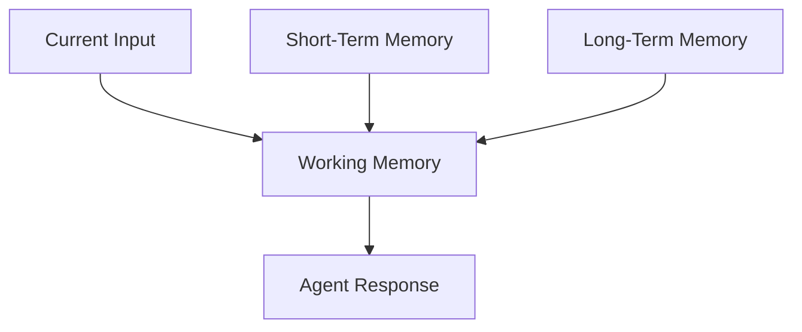
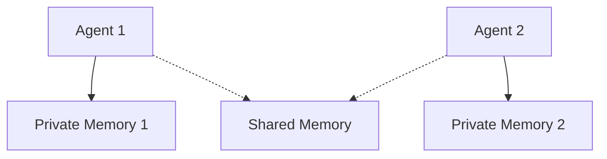

# Agent Memory

Memory enables AI agents to remember past interactions, maintain context, and provide more coherent responses over time. Without memory, agents would treat each interaction as if it was their first.

## Why Memory Matters

## Types of Agent Memory

### 1. Short-Term Memory (Conversation Memory)

This type of memory stores recent interactions within a session.



The agent can refer back to earlier messages in the same conversation.

### 2. Long-Term Memory

This allows agents to remember information across different sessions.

### 3. Working Memory

This is where agents process current information and combine it with retrieved memories.



## How Memory Works in PraisonAI

In the PraisonAI framework, memory is handled automatically for basic cases and can be customized for more advanced needs:

```python
from praisonaiagents import Agent

# Basic agent with default memory handling

agent = Agent(
 instructions="You are a helpful assistant that remembers our conversations"
)

# The conversation history is maintained automatically

agent.start("My name is Alex")
agent.continue("What's my name?")# Note: TODO: This Feature yet to be developed # Agent will remember "Alex"

```

## Memory Limitations

Common limitations include:

## Implementing Persistent Memory

For more advanced applications, you can implement custom memory systems:

```python
# Note: TODO: This Feature yet to be tested

from praisonaiagents import Agent, Memory

# Create a simple memory store

memory = Memory()

# Add information to memory

memory.add("user_name", "Alex")
memory.add("favorite_color", "blue")

# Create agent with this memory

agent = Agent(
 instructions="You are a personal assistant",
 memory=memory
)

# The agent can now access these memories

agent.start("What's my favorite color?") # Agent should respond "blue"

```

## Memory Best Practices

## Memory in Multi-Agent Systems

In systems with multiple agents, memory can be:
1. **Private**: Each agent has its own memories
2. **Shared**: Agents have access to a common memory store
3. **Hybrid**: Some memories are private, others are shared



In the next lesson, we'll learn about how to set up multiple agents to work together effectively.