# Agent Tasks

Tasks are the specific units of work that AI agents perform. Understanding how to define and manage tasks is essential for creating effective agent systems.

## What is an Agent Task?

Just as human jobs are broken into specific responsibilities, agent systems work best when complex goals are divided into manageable tasks.

## Anatomy of a Task

A well-defined task includes:

## Task Types

### 1. Information Tasks

These tasks involve finding, analyzing, or summarizing information.

**Examples:**
- Research a topic
- Summarize a document
- Extract data from text
- Answer questions

### 2. Creation Tasks

These tasks involve generating new content.

**Examples:**
- Write an article
- Create a marketing plan
- Generate images (with appropriate tools)
- Design a workflow

### 3. Analysis Tasks

These tasks involve evaluating information and drawing conclusions.

**Examples:**
- Analyze data trends
- Review content for quality
- Evaluate options
- Identify patterns

### 4. Interaction Tasks

These tasks involve communicating or working with users or other systems.

**Examples:**
- Answer customer questions
- Guide users through processes
- Collect information from users
- Notify about events

## Creating Tasks in PraisonAI

### Task Flow

The typical lifecycle of a task follows this pattern:


### Task Configuration

# Understanding Tasks

```mermaid
graph LR
 %% Task Flow Steps
 Start([▶ Start]) --> TaskDef
 TaskDef --> AgentAssign
 AgentAssign --> Exec
 Exec --> Output([✓ Output])

 %% Define subgraphs for each step
 subgraph TaskDef[" "]
 TD_Icon[📋 Task Definition]
 TD_Desc[Description & Requirements]

 TD_Icon --- TD_Desc

 style TD_Icon fill:#2D3047,stroke:#7C90A0,color:#fff
 style TD_Desc fill:#5C80BC,stroke:#7C90A0,color:#fff
 end

 subgraph AgentAssign[" "]
 AA_Icon[🤖 Agent Assignment]
 AA_Desc[Matching & Delegation]

 AA_Icon --- AA_Desc

 style AA_Icon fill:#2D3047,stroke:#7C90A0,color:#fff
 style AA_Desc fill:#5C80BC,stroke:#7C90A0,color:#fff
 end

 subgraph Exec[" "]
 E_Icon[⚙️ Execution]
 E_Desc[Processing & Tools]

 E_Icon --- E_Desc

 style E_Icon fill:#2D3047,stroke:#7C90A0,color:#fff
 style E_Desc fill:#5C80BC,stroke:#7C90A0,color:#fff
 end

 %% Styling for main elements
 style Start fill:#2D3047,stroke:#7C90A0,color:#fff
 style Output fill:#2D3047,stroke:#7C90A0,color:#fff

 %% Style for containers
 style TaskDef fill:#1B1F3B,stroke:#7C90A0,color:#fff
 style AgentAssign fill:#1B1F3B,stroke:#7C90A0,color:#fff
 style Exec fill:#1B1F3B,stroke:#7C90A0,color:#fff

 %% Global styles
 classDef default fill:#2D3047,stroke:#7C90A0,color:#fff
 linkStyle default stroke:#7C90A0,stroke-width:2px
```

```mermaid
graph LR
 %% Task States
 Pending([📥 Pending]) --> InProgress([⚡ In Progress])
 InProgress --> Completed([✅ Completed])
 InProgress --> Failed([❌ Failed])

 %% Styling
 style Pending fill:#2D3047,stroke:#7C90A0,color:#fff
 style InProgress fill:#5C80BC,stroke:#7C90A0,color:#fff
 style Completed fill:#2D3047,stroke:#7C90A0,color:#fff
 style Failed fill:#2D3047,stroke:#7C90A0,color:#fff

 %% Global styles
 classDef default fill:#2D3047,stroke:#7C90A0,color:#fff
 linkStyle default stroke:#7C90A0,stroke-width:2px
```





## Task Types

## Task Relationships

### Context Sharing

```python
task_a = Task(name="research")
task_b = Task(
 name="analyze",
 context=[task_a] # Uses task_a's output

)
```

## Task Best Practices

## Common Task Mistakes

In the next lesson, we'll learn about creating your first complete agent application.