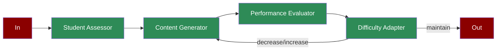

# Adaptive Learning

Learn how to implement an adaptive learning system using AI agents for personalized education and dynamic content adjustment.

## Quick Start

## Understanding Adaptive Learning

## Features

## Next Steps