# Code Analysis Agent

```mermaid
flowchart LR
 In[In] --> Analyzer[Code Analyzer]
 Analyzer --> Quality[Quality Assessment]
 Quality --> Metrics[Core Metrics]
 Metrics --> Technical[Technical Review]
 Technical --> Recommendations[Recommendations]
 Recommendations --> Out[Out]

 style In fill:#8B0000,color:#fff
 style Analyzer fill:#2E8B57,color:#fff
 style Quality fill:#2E8B57,color:#fff
 style Metrics fill:#2E8B57,color:#fff
 style Technical fill:#2E8B57,color:#fff
 style Recommendations fill:#2E8B57,color:#fff
 style Out fill:#8B0000,color:#fff
```

## What is Code Analysis?

Code Analysis is a systematic process of evaluating source code to assess its quality, maintainability, performance, and security. This helps developers and organizations maintain high code standards and identify areas for improvement.

## Features

## Quick Start

## Understanding the Output

The code analysis generates a comprehensive report with the following components:
- Overall Quality Score (0-100)
- Core Metrics Analysis
- Architecture and Design Score
- Code Maintainability Score
- Performance Score
- Security Score
- Test Coverage Percentage
- Technical Assessment
- Technology Stack
- Complexity Metrics
- Best Practices Review
- Risk Assessment
- Recommendations
- Key Improvements
- Architecture Suggestions
- Security Enhancements

## Next Steps