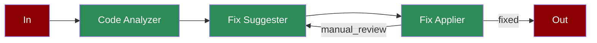

# Code Review

A workflow demonstrating how AI agents can automate code review, from analysis through fix suggestion and application.

## Quick Start

## Understanding Code Review

## Features

## Next Steps