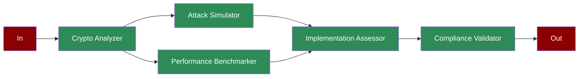

# Crypto Validator

## What is Post-Quantum Cryptography?

Post-quantum cryptography focuses on developing cryptographic systems that are secure against both quantum and classical computers. This involves analyzing cryptographic schemes, simulating quantum attacks, and ensuring compliance with security standards.

## Features

## Quick Start

## Next Steps