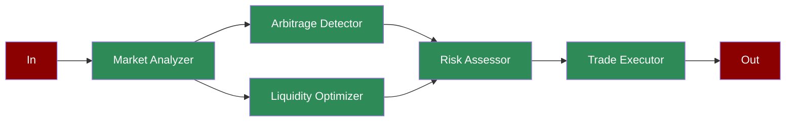

# DeFi Market Maker

## What is DeFi Market Making?

Decentralized Finance (DeFi) market making involves providing liquidity to decentralized exchanges and automatically executing trades to capture arbitrage opportunities. This requires real-time analysis of market conditions, optimization of liquidity positions, and risk management.

## Features

## Quick Start

## Next Steps