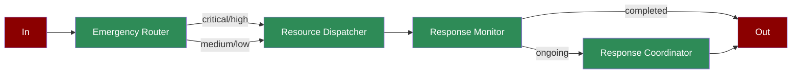

# Emergency Response

A workflow demonstrating how AI agents can coordinate emergency response, from initial assessment through resource dispatch and response monitoring.

## Quick Start

## Understanding Emergency Response

## Features

## Next Steps