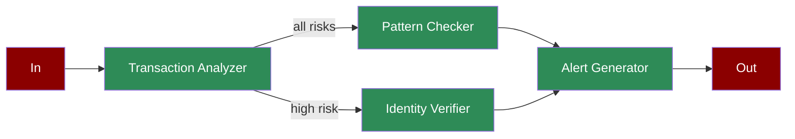

# Fraud Detection

A workflow demonstrating how AI agents can detect fraud in real-time, from transaction analysis through alert generation.

## Quick Start

## Understanding Fraud Detection

## Features

## Next Steps