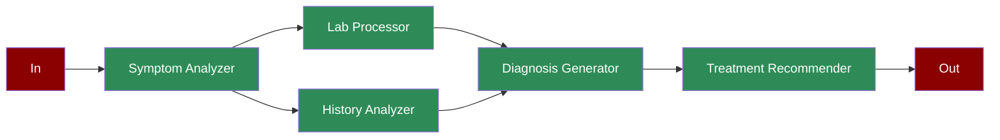

# Healthcare Diagnosis

Learn how to implement an automated healthcare diagnosis system using AI agents for symptom analysis, lab processing, and treatment recommendations.

## Quick Start

## Understanding Healthcare Diagnosis

## Features

## Next Steps