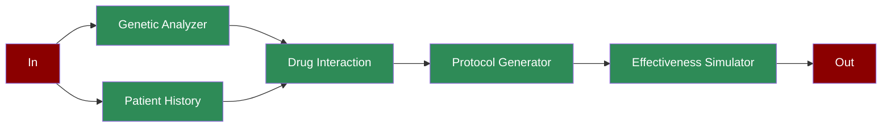

# Medicine Protocol

## What is Personalized Medicine?

Personalized medicine is an approach that tailors medical treatment to individual characteristics of each patient. It involves analyzing genetic markers, patient history, and drug interactions to create optimized treatment protocols.

## Features

## Quick Start

## Next Steps