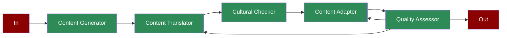

# Multilingual Content

Learn how to implement a multilingual content generation system using AI agents for content creation, translation, cultural adaptation, and quality assurance.

## Quick Start

## Understanding Multilingual Content Generation

## Features

## Next Steps