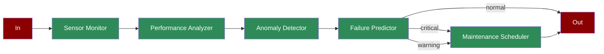

# Predictive Maintenance

Learn how to implement a predictive maintenance system using AI agents for real-time equipment monitoring and maintenance scheduling.

## Quick Start

## Understanding Predictive Maintenance

## Features

## Next Steps