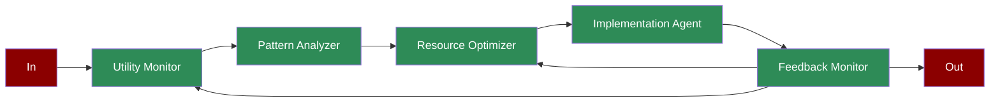

# Smart City

Learn how to implement a smart city resource management system using AI agents for monitoring, analysis, and optimization of city utilities.

## Quick Start

## Understanding Smart City Management

## Features

## Next Steps