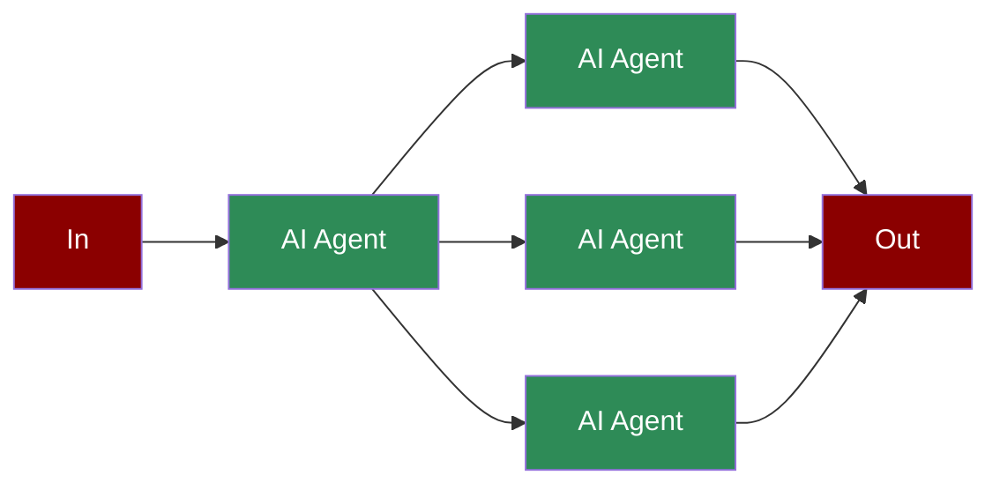

# Async Agents

Async AI Agents allow you to run AI tasks asynchronously, improving performance and efficiency in your applications.

## Quick Start

## Understanding Async Execution

## Features

## Advanced Usage

## Best Practices

## Troubleshooting

## API Reference

### Async Methods

### Task Properties

## Next Steps