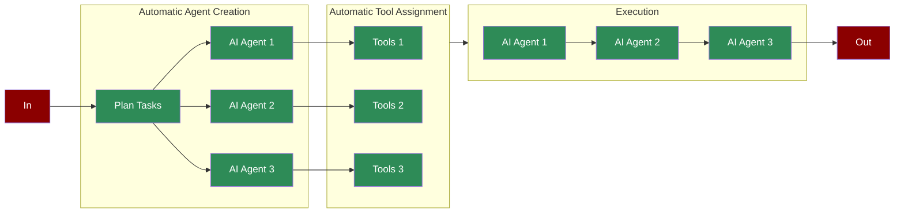

# AutoAgents



AutoAgents automatically creates and manages AI agents and tasks based on high-level instructions.

## Quick Start

## Understanding AutoAgents

## Features

## Advanced Usage

### Configuration Options

```python

# Create AutoAgents with advanced configuration

agents = AutoAgents(
 instructions="Research and summarize recent AI developments",
 tools=[SerperDevTool, WikipediaTools],
 max_agents=3, # Maximum number of agents to create

 verbose=True, # Enable detailed logging

 process="hierarchical", # Use hierarchical process

 memory=True, # Enable memory for agents

 allow_delegation=True, # Allow task delegation

 max_rpm=60, # Maximum requests per minute

 max_execution_time=300, # Maximum execution time in seconds

 allow_code_execution=True, # Allow code execution

 code_execution_mode="safe", # Use safe mode for code execution

 self_reflect=True, # Enable agent self-reflection

 markdown=True # Enable markdown formatting

)
```

### Process Types

## Best Practices

## Troubleshooting

## API Reference

### Main Parameters

### Optional Parameters

### Methods

## Next Steps