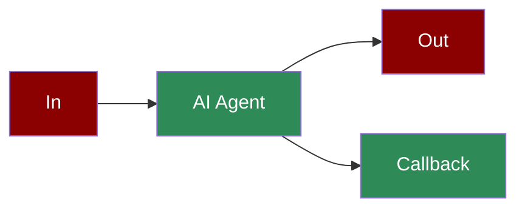

# AI Agents with Callbacks



Learn how to implement callbacks to monitor and log AI agent interactions, errors, and task completions.

## Quick Start

## Understanding Callbacks

## Features

## Basic Implementation

### 1. Simple Logging Callback

### 2. Multiple Callback Types

## Complete Example

Here's a full implementation showing all callback types and proper logging:

## Advanced Examples

- All callback types
- Comprehensive logging
- Task callbacks
- Tool integration
- Multiple agents

## Async Callbacks

Async callbacks allow you to handle events asynchronously, which is particularly useful for long-running operations or when dealing with multiple agents simultaneously.

### Basic Async Callback Implementation

### Complete Async Example

## Async Display Functions

PraisonAI Agents provides several async versions of display functions, prefixed with 'a'. Here's the complete list:

#### Example Usage

```python
import asyncio
from praisonaiagents import (
 adisplay_interaction,
 adisplay_error,
 adisplay_tool_call
)

async def main():
 # Display an interaction

 await adisplay_interaction(
 message="What's the weather?",
 response="Let me check that for you.",
 generation_time=0.5
 )

 # Display a tool call

 await adisplay_tool_call(
 "Calling weather API for location data..."
 )

 # Handle an error

 try:
 raise Exception("API connection failed")
 except Exception as e:
 await adisplay_error(str(e))

if __name__ == "__main__":
 asyncio.run(main())
```

## Best Practices

## Next Steps