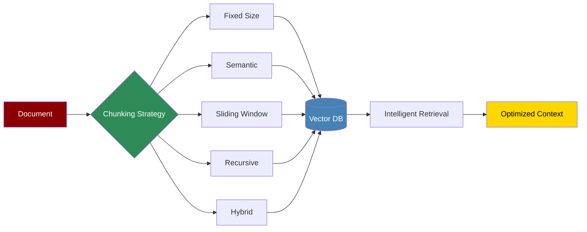

# Chunking Strategies



Chunking strategies determine how documents are split for storage and retrieval, directly impacting the quality and efficiency of RAG (Retrieval Augmented Generation) systems.

## Quick Start

## Chunking Strategies

### Fixed-Size Chunking

Simple, fast chunking with fixed character or token counts.

```python
from praisonaiagents.knowledge import FixedSizeChunker

# Character-based chunking

char_chunker = FixedSizeChunker(
 chunk_size=1000, # 1000 characters

 chunk_overlap=100, # 100 character overlap

 unit="characters"
)

# Token-based chunking

token_chunker = FixedSizeChunker(
 chunk_size=256, # 256 tokens

 chunk_overlap=25, # 25 token overlap

 unit="tokens",
 tokenizer="cl100k_base" # OpenAI tokenizer

)

chunks = char_chunker.chunk_text(document)
```

### Semantic Chunking

Intelligently splits text based on meaning and context.

```python
from praisonaiagents.knowledge import SemanticChunker

# Initialize semantic chunker

semantic_chunker = SemanticChunker(
 embedding_model="text-embedding-ada-002",
 similarity_threshold=0.8,
 min_chunk_size=100,
 max_chunk_size=1000
)

# Chunk with semantic boundaries

chunks = semantic_chunker.chunk_document(
 document,
 preserve_sentences=True,
 preserve_paragraphs=True
)

# Each chunk maintains semantic coherence

for chunk in chunks:
 print(f"Semantic score: {chunk.coherence_score}")
 print(f"Boundary type: {chunk.boundary_type}")
```

### Sliding Window Chunking

Creates overlapping chunks for better context preservation.

```python
from praisonaiagents.knowledge import SlidingWindowChunker

# Configure sliding window

sliding_chunker = SlidingWindowChunker(
 window_size=512,
 step_size=256, # 50% overlap

 context_window=50 # Additional context tokens

)

# Create overlapping chunks

chunks = sliding_chunker.chunk_with_context(
 document,
 include_previous=True,
 include_next=True
)

# Useful for maintaining context continuity

for chunk in chunks:
 print(f"Previous context: {chunk.previous_context}")
 print(f"Main content: {chunk.content}")
 print(f"Next context: {chunk.next_context}")
```

### Recursive Chunking

Hierarchically splits documents maintaining structure.

```python
from praisonaiagents.knowledge import RecursiveChunker

# Initialize recursive chunker

recursive_chunker = RecursiveChunker(
 separators=["\n\n", "\n", ". ", " "], # Hierarchical separators

 chunk_size=1000,
 chunk_overlap=100,
 preserve_structure=True
)

# Chunk maintaining document structure

chunks = recursive_chunker.chunk_hierarchically(
 document,
 maintain_headers=True,
 maintain_lists=True
)

# Access chunk hierarchy

for chunk in chunks:
 print(f"Level: {chunk.hierarchy_level}")
 print(f"Parent: {chunk.parent_id}")
 print(f"Children: {chunk.child_ids}")
```

### Hybrid Chunking

Combines multiple strategies for optimal results.

```python
from praisonaiagents.knowledge import HybridChunker

# Configure hybrid strategy

hybrid_chunker = HybridChunker(
 primary_strategy="semantic",
 fallback_strategy="recursive",
 optimization_goal="retrieval_quality" # or "speed" or "balance"

)

# Apply hybrid chunking

chunks = hybrid_chunker.smart_chunk(
 document,
 document_type="research_paper", # Adapts strategy to document type

 quality_threshold=0.85
)

# Get chunking analytics

analytics = hybrid_chunker.get_analytics()
print(f"Strategy distribution: {analytics['strategy_usage']}")
print(f"Average chunk quality: {analytics['avg_quality']}")
```

## Advanced Chunking Features

### Document-Type Specific Chunking

```python
from praisonaiagents.knowledge import DocumentTypeChunker

# Initialize with document type awareness

doc_chunker = DocumentTypeChunker()

# Chunk different document types optimally

# For code files

code_chunks = doc_chunker.chunk_code(
 code_content,
 language="python",
 preserve_functions=True,
 preserve_classes=True,
 include_comments=True
)

# For markdown documents

md_chunks = doc_chunker.chunk_markdown(
 markdown_content,
 preserve_headers=True,
 preserve_code_blocks=True,
 max_header_depth=3
)

# For structured documents (JSON, XML)

structured_chunks = doc_chunker.chunk_structured(
 json_content,
 preserve_objects=True,
 max_nesting_depth=5
)

# For tables and CSVs

table_chunks = doc_chunker.chunk_tabular(
 csv_content,
 preserve_rows=True,
 group_by_column=None,
 max_rows_per_chunk=100
)
```

### Context-Aware Chunking

```python
# Chunking with context preservation

context_chunker = ContextAwareChunker(
 context_window_size=100,
 context_overlap=20
)

# Process with context

contextual_chunks = context_chunker.chunk_with_context(
 document,

)

# Each chunk includes:

for chunk in contextual_chunks:
 print(f"Content: {chunk.content}")
 print(f"Context before: {chunk.context_before}")
 print(f"Context after: {chunk.context_after}")
 print(f"Document context: {chunk.document_metadata}")
```

### Multi-Modal Chunking

```python
from praisonaiagents.knowledge import MultiModalChunker

# Initialize multi-modal chunker

mm_chunker = MultiModalChunker(
 text_strategy="semantic",
 preserve_media_references=True
)

# Process documents with images, tables, etc.

multimodal_chunks = mm_chunker.chunk_multimodal(
 document_path="research_paper.pdf",
 extract_images=True,
 extract_tables=True,
 extract_equations=True
)

for chunk in multimodal_chunks:
 print(f"Type: {chunk.content_type}")
 if chunk.content_type == "text":
 print(f"Text: {chunk.text_content}")
 elif chunk.content_type == "image":
 print(f"Image: {chunk.image_path}")
 print(f"Caption: {chunk.image_caption}")
 elif chunk.content_type == "table":
 print(f"Table: {chunk.table_data}")
```

## Chunking Optimization

### Performance Optimization

```python
# Optimize for speed vs quality

optimization_config = {
 "speed": {
 "strategy": "fixed_size",
 "parallel_processing": True,
 "batch_size": 100
 },
 "quality": {
 "strategy": "semantic",
 "embedding_cache": True,
 "quality_checks": True
 },
 "balanced": {
 "strategy": "hybrid",
 "adaptive_sizing": True,
 "smart_caching": True
 }
}

# Create optimized chunker

optimized_chunker = create_optimized_chunker(
 optimization_goal="balanced",
 **optimization_config["balanced"]
)

# Benchmark different strategies

benchmark_results = benchmark_chunking_strategies(
 document=large_document,
 strategies=["fixed", "semantic", "recursive", "hybrid"],
 metrics=["speed", "quality", "retrieval_accuracy"]
)
```

### Chunk Quality Assessment

```python
from praisonaiagents.knowledge import ChunkQualityAnalyzer

# Initialize quality analyzer

analyzer = ChunkQualityAnalyzer(
 embedding_model="text-embedding-ada-002"
)

# Analyze chunk quality

quality_report = analyzer.analyze_chunks(chunks)

print(f"Average coherence: {quality_report['avg_coherence']}")
print(f"Information density: {quality_report['info_density']}")
print(f"Boundary quality: {quality_report['boundary_quality']}")
print(f"Retrieval score: {quality_report['retrieval_score']}")

# Get recommendations

recommendations = analyzer.get_improvement_recommendations()
for rec in recommendations:
 print(f"Issue: {rec['issue']}")
 print(f"Solution: {rec['solution']}")
```

## Integration with RAG

### Chunking for Retrieval

```python
from praisonaiagents.knowledge import RAGOptimizedChunker

# Create RAG-optimized chunker

rag_chunker = RAGOptimizedChunker(
 embedding_model="text-embedding-ada-002",
 retrieval_model="gpt-3.5-turbo",
 optimization_metric="retrieval_precision"
)

# Chunk and prepare for RAG

rag_chunks = rag_chunker.prepare_for_rag(
 documents=document_list,
 index_name="research_papers",
 create_summaries=True,
 create_questions=True # Generate questions each chunk can answer

)

# Each chunk includes:

for chunk in rag_chunks:
 print(f"Content: {chunk.content}")
 print(f"Summary: {chunk.summary}")
 print(f"Questions: {chunk.answerable_questions}")
 print(f"Keywords: {chunk.keywords}")
 print(f"Embedding: {chunk.embedding}")
```

### Adaptive Chunking Based on Queries

```python
# Adapt chunking based on query patterns

adaptive_chunker = QueryAdaptiveChunker(
 query_history=previous_queries,
 performance_metrics=retrieval_metrics
)

# Re-chunk based on usage patterns

adaptive_chunks = adaptive_chunker.adapt_chunking(
 document=document,
 frequent_query_types=["definition", "comparison", "example"],
 optimize_for="query_relevance"
)

# Monitor and improve

performance = adaptive_chunker.measure_performance(
 test_queries=test_query_set,
 ground_truth=ground_truth_answers
)
```

## Best Practices

## Troubleshooting

## Next Steps