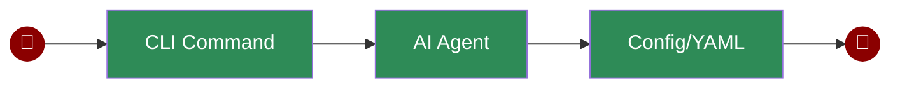

# Command Line Interface

PraisonAI CLI provides a simple way to interact with AI agents directly from your terminal. You can run quick commands, specify LLM options, or use YAML configuration files for more complex scenarios.

## Quick Start

## Usage Examples

## Configuration

## Features

## Next Steps