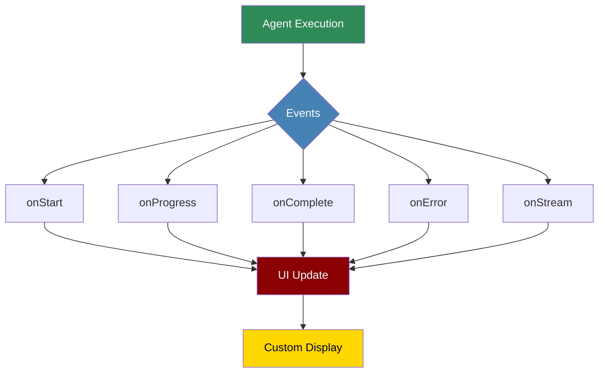

# Display Callbacks



Display Callbacks provide a powerful system for customizing how agent activities are displayed, enabling rich UI experiences and real-time feedback.

## Quick Start

## Callback Types

### Basic Callbacks

```python
from praisonaiagents.display import BasicCallbacks

class MyCallbacks(BasicCallbacks):
 def on_workflow_start(self, workflow):
 """Called when workflow begins"""
 print(f"Starting workflow with {len(workflow.agents)} agents")

 def on_workflow_complete(self, workflow, results):
 """Called when workflow completes"""
 print(f"Workflow completed in {workflow.execution_time}s")

 def on_task_start(self, task):
 """Called when a task begins"""
 print(f"Task '{task.name}' starting")

 def on_task_complete(self, task, result):
 """Called when a task completes"""
 print(f"Task '{task.name}' completed")

 def on_task_error(self, task, error):
 """Called when a task fails"""
 print(f"Task '{task.name}' failed: {error}")
```

### Progress Callbacks

```python
from praisonaiagents.display import ProgressCallbacks

class ProgressDisplay(ProgressCallbacks):
 def __init__(self):
 self.progress_bars = {}

 def on_progress_start(self, task_id, total_steps):
 """Initialize progress tracking"""
 self.progress_bars[task_id] = {
 'current': 0,
 'total': total_steps
 }
 self._draw_progress_bar(task_id)

 def on_progress_update(self, task_id, current_step, message=None):
 """Update progress"""
 self.progress_bars[task_id]['current'] = current_step
 self._draw_progress_bar(task_id)
 if message:
 print(f" └─ {message}")

 def on_progress_complete(self, task_id):
 """Mark progress as complete"""
 self.progress_bars[task_id]['current'] = self.progress_bars[task_id]['total']
 self._draw_progress_bar(task_id)
 print(" └─ ✓ Complete")

 def _draw_progress_bar(self, task_id):
 bar = self.progress_bars[task_id]
 percent = bar['current'] / bar['total'] * 100
 filled = int(percent / 2)
 bar_str = '█' * filled + '░' * (50 - filled)
 print(f"\r[{bar_str}] {percent:.1f}%", end='', flush=True)

# Use with agents

agent = Agent(
 name="Progress Agent",
 progress_callbacks=ProgressDisplay()
)
```

### Stream Callbacks

```python
from praisonaiagents.display import StreamCallbacks

class StreamingDisplay(StreamCallbacks):
 def __init__(self):
 self.buffer = ""
 self.typing_delay = 0.03 # seconds

 def on_stream_start(self, agent):
 """Called when streaming begins"""
 print(f"\n{agent.name}: ", end='', flush=True)

 def on_stream_chunk(self, chunk):
 """Handle each chunk of streamed text"""
 # Simulate typing effect

 for char in chunk:
 print(char, end='', flush=True)
 time.sleep(self.typing_delay)
 self.buffer += chunk

 def on_stream_complete(self):
 """Called when streaming completes"""
 print("\n") # New line after streaming

 return self.buffer

 def on_stream_error(self, error):
 """Handle streaming errors"""
 print(f"\n[Stream Error: {error}]")

# Enable streaming for agent

agent = Agent(
 name="Streaming Agent",
 stream_callbacks=StreamingDisplay(),
 stream_output=True
)
```

### UI Integration Callbacks

```python
from praisonaiagents.display import UICallbacks
import json

class WebUICallbacks(UICallbacks):
 def __init__(self, websocket):
 self.websocket = websocket

 async def on_agent_update(self, agent, update_type, data):
 """Send updates to web UI"""
 message = {
 "type": "agent_update",
 "agent": agent.name,
 "update_type": update_type,
 "data": data,
 "timestamp": time.time()
 }
 await self.websocket.send(json.dumps(message))

 async def on_task_update(self, task, status, details=None):
 """Update task status in UI"""
 message = {
 "type": "task_update",
 "task": task.name,
 "status": status,
 "details": details,
 "timestamp": time.time()
 }
 await self.websocket.send(json.dumps(message))

 async def on_metrics_update(self, metrics):
 """Send performance metrics to UI"""
 message = {
 "type": "metrics",
 "data": metrics,
 "timestamp": time.time()
 }
 await self.websocket.send(json.dumps(message))

# Use with WebSocket server

async def handle_client(websocket):
 ui_callbacks = WebUICallbacks(websocket)

 workflow = PraisonAIAgents(
 agents=[...],
 tasks=[...],
 display_callbacks=ui_callbacks
 )

 await workflow.async_start()
```

## Advanced Display Features

### Rich Terminal Display

```python
from praisonaiagents.display import RichDisplay
from rich.console import Console
from rich.table import Table
from rich.live import Live
from rich.panel import Panel

class RichTerminalDisplay(RichDisplay):
 def __init__(self):
 self.console = Console()
 self.live_display = None
 self.status_table = Table(title="Agent Status")
 self.setup_table()

 def setup_table(self):
 self.status_table.add_column("Agent", style="cyan")
 self.status_table.add_column("Status", style="green")
 self.status_table.add_column("Current Task")
 self.status_table.add_column("Progress")

 def on_workflow_start(self, workflow):
 self.live_display = Live(self.status_table, refresh_per_second=4)
 self.live_display.start()

 def on_agent_status_change(self, agent, status, task=None, progress=None):
 # Update table with agent status

 self.update_agent_row(agent.name, status, task, progress)
 self.live_display.update(self.status_table)

 def on_agent_output(self, agent, output):
 # Display agent output in a panel

 panel = Panel(
 output,
 title=f"[bold]{agent.name}[/bold]",
 border_style="blue"
 )
 self.console.print(panel)

 def on_workflow_complete(self, workflow, results):
 self.live_display.stop()
 self.console.print("[bold green]Workflow Complete![/bold green]")
```

### Interactive Callbacks

```python
from praisonaiagents.display import InteractiveCallbacks

class InteractiveDisplay(InteractiveCallbacks):
 def on_user_input_required(self, agent, prompt, options=None):
 """Handle user input requests"""
 print(f"\n{agent.name} needs your input:")
 print(f"📝 {prompt}")

 if options:
 for i, option in enumerate(options, 1):
 print(f" {i}. {option}")
 choice = input("Select option (number): ")
 return options[int(choice) - 1]
 else:
 return input("Your response: ")

 def on_confirmation_required(self, agent, action, details):
 """Handle confirmation requests"""
 print(f"\n⚠️ {agent.name} requires confirmation:")
 print(f"Action: {action}")
 print(f"Details: {details}")

 response = input("Proceed? (yes/no): ")
 return response.lower() == 'yes'

 def on_review_required(self, agent, content, editable=True):
 """Handle content review requests"""
 print(f"\n📄 {agent.name} generated content for review:")
 print("-" * 50)
 print(content)
 print("-" * 50)

 if editable:
 edit = input("Edit content? (yes/no): ")
 if edit.lower() == 'yes':
 # Open in editor or get multiline input

 edited_content = self.get_edited_content(content)
 return edited_content

 return content
```

### Custom Visualization Callbacks

```python
from praisonaiagents.display import VisualizationCallbacks
import matplotlib.pyplot as plt

class VisualizationDisplay(VisualizationCallbacks):
 def __init__(self):
 self.metrics = {
 'task_times': [],
 'token_usage': [],
 'success_rates': []
 }

 def on_task_complete(self, task, result, metrics):
 """Collect metrics for visualization"""
 self.metrics['task_times'].append(metrics['execution_time'])
 self.metrics['token_usage'].append(metrics['tokens_used'])
 self.metrics['success_rates'].append(1 if result.success else 0)

 def on_workflow_complete(self, workflow, results):
 """Generate visualizations"""
 self.plot_performance_metrics()
 self.plot_token_usage()
 self.plot_success_rates()

 def plot_performance_metrics(self):
 plt.figure(figsize=(10, 6))
 plt.bar(range(len(self.metrics['task_times'])),
 self.metrics['task_times'])
 plt.xlabel('Task Number')
 plt.ylabel('Execution Time (s)')
 plt.title('Task Execution Times')
 plt.savefig('task_performance.png')

 def plot_token_usage(self):
 plt.figure(figsize=(10, 6))
 plt.plot(self.metrics['token_usage'], marker='o')
 plt.xlabel('Task Number')
 plt.ylabel('Tokens Used')
 plt.title('Token Usage Over Time')
 plt.savefig('token_usage.png')
```

## Integration Examples

### Gradio Integration

```python
import gradio as gr
from praisonaiagents.display import GradioCallbacks

class GradioDisplay(GradioCallbacks):
 def __init__(self):
 self.output_queue = []
 self.status = "Ready"

 def create_interface(self):
 def process_input(user_input):
 # Update status

 self.status = "Processing..."

 # Create and run workflow

 workflow = create_workflow(user_input, display_callbacks=self)
 results = workflow.start()

 # Return accumulated output

 return "\n".join(self.output_queue)

 # Create Gradio interface

 interface = gr.Interface(
 fn=process_input,
 inputs=gr.Textbox(label="Enter your request"),
 outputs=gr.Textbox(label="Agent Output", lines=10),
 title="AI Agent Assistant",
 description="Interactive AI agent with real-time display"
 )

 return interface

 def on_agent_output(self, agent, output):
 self.output_queue.append(f"{agent.name}: {output}")
```

### Streamlit Integration

```python
import streamlit as st
from praisonaiagents.display import StreamlitCallbacks

class StreamlitDisplay(StreamlitCallbacks):
 def __init__(self):
 self.container = st.container()
 self.progress_bar = st.progress(0)
 self.status_text = st.empty()

 def on_agent_start(self, agent, task):
 self.status_text.text(f"🚀 {agent.name} working on: {task.description}")

 def on_progress_update(self, progress):
 self.progress_bar.progress(progress)

 def on_agent_output(self, agent, output):
 with self.container:
 st.info(f"**{agent.name}**: {output}")

 def on_agent_complete(self, agent, result):
 with self.container:
 st.success(f"✅ {agent.name} completed successfully!")

# Use in Streamlit app

st.title("AI Agent Dashboard")
display = StreamlitDisplay()

if st.button("Run Agents"):
 workflow = create_workflow(display_callbacks=display)
 results = workflow.start()
 st.balloons()
```

## Callback Composition

```python
from praisonaiagents.display import CallbackComposer

# Compose multiple callback handlers

composer = CallbackComposer([
 ConsoleDisplay(), # Terminal output

 FileLogger(), # Log to file

 MetricsCollector(), # Collect metrics

 WebUIUpdater() # Update web UI

])

# All callbacks will be triggered

workflow = PraisonAIAgents(
 agents=[...],
 tasks=[...],
 display_callbacks=composer
)
```

## Best Practices

## Troubleshooting

## Next Steps