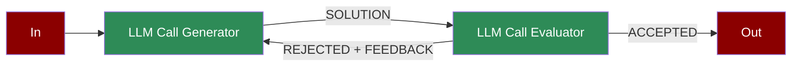

# Agentic Evaluator Optimizer



A feedback loop workflow where LLM-generated outputs are evaluated, refined, and optimized iteratively to improve accuracy and relevance.

## Quick Start

## Understanding Evaluator-Optimizer

## Features

## Configuration Options

```python
# Create a generator agent

generator = Agent(
 name="Generator",
 role="Solution generator",
 goal="Generate and improve solutions",
 instructions="Step-by-step instructions for generation",
 verbose=True # Enable detailed logging

)

# Create an evaluator agent

evaluator = Agent(
 name="Evaluator",
 role="Solution evaluator",
 goal="Evaluate and provide feedback",
 instructions="Evaluation criteria and feedback format"
)

# Create tasks with feedback loop

generate_task = Task(
 name="generate",
 description="Generate solution",
 agent=generator,
 is_start=True,
 task_type="decision",
 next_tasks=["evaluate"]
)

evaluate_task = Task(
 name="evaluate",
 description="Evaluate solution",
 agent=evaluator,
 context=[generate_task],
 task_type="decision",

)
```

## Troubleshooting

## Next Steps