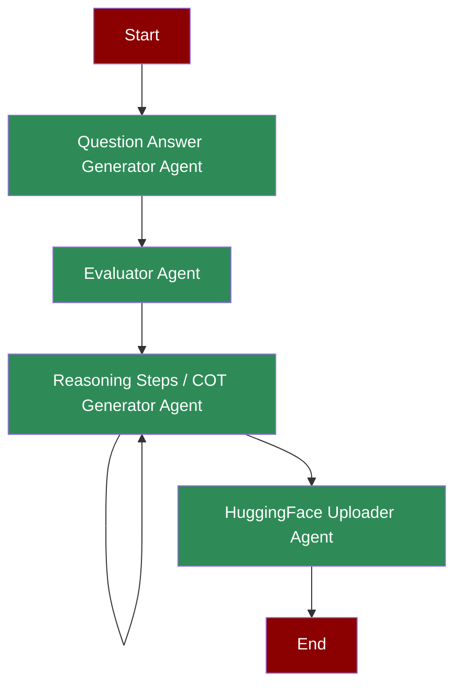

# Generate Synthetic Reasoning Data Agents

## What is Chain-of-Thought Generation?

Chain-of-Thought (CoT) Generation is a process where AI agents create detailed, step-by-step reasoning paths for solving problems. This involves generating questions, evaluating them, producing detailed solution steps, and making the data available for training and analysis.

## Quick Start

## Features

## Understanding the Workflow

## Next Steps