# Guardrails System

Guardrails provide output validation and quality assurance for agent tasks, ensuring results meet specified criteria before being accepted.

```mermaid
graph LR
 Task[📋 Task] --> Agent[🤖 Agent]
 Agent --> Output[📄 Output]
 Output --> Guardrail{🛡️ Guardrail}

 Guardrail -->|Pass| Success[✅ Validated Output]
 Guardrail -->|Fail| Retry{🔄 Retry?}

 Retry -->|Yes| Agent
 Retry -->|No| Error[❌ Task Failed]

 subgraph Guardrail Types
 FUNC[🔧 Function-based]
 LLM[🧠 LLM-based]
 end

 classDef task fill:#8B0000,stroke:#7C90A0,color:#fff
 classDef process fill:#189AB4,stroke:#7C90A0,color:#fff
 classDef validation fill:#2E8B57,stroke:#7C90A0,color:#fff
 classDef result fill:#FF6B6B,stroke:#7C90A0,color:#fff

 class Task task
 class Agent,Output process
 class Guardrail,FUNC,LLM validation
 class Success,Error,Retry result
```



## Overview

Guardrails ensure task outputs meet quality and safety criteria through:
* **Function-based validation** for structured checks
* **LLM-based validation** for natural language criteria
* **Automatic retry mechanisms** for failed validations
* **Custom validation logic** for specific requirements

## Quick Start

## Guardrail Types

### Function-Based Guardrails

Function guardrails provide programmatic validation:

### LLM-Based Guardrails

LLM guardrails use natural language for validation:

## Advanced Features

### Retry Configuration

Configure retry behaviour for failed validations:

```python
task = Task(
 description="Generate validated content",
 agent=agent,
 guardrail=validation_function,
 max_retries=3, # Maximum retry attempts

 retry_delay=2, # Delay between retries (seconds)

 retry_with_feedback=True # Pass failure reason to agent

)
```

### Composite Guardrails

Combine multiple validation criteria:

```python
def composite_guardrail(task_output):
 """Multiple validation checks"""
 # Check 1: Length

 if len(task_output.raw) tuple[bool, any]:
 """Ensure output is within length limits"""
 if len(output.raw) > 500:
 return False, "Output too long, please summarize"
 if len(output.raw) tuple[bool, any]:
 """Ensure content is appropriate"""
 prohibited_words = ["spam", "scam", "illegal"]
 content_lower = output.raw.lower()

 for word in prohibited_words:
 if word in content_lower:
 return False, f"Content contains prohibited word: {word}"

 return True, output

agent = Agent(
 name="Content Creator",
 role="Blog writer"
)

task = Task(
 description="Write article about online safety",
 agent=agent,
 guardrail=content_guardrail
)
```

### Data Format Validation

```python
import json

def json_guardrail(output: TaskOutput) -> tuple[bool, any]:
 """Ensure output is valid JSON with required fields"""
 try:
 data = json.loads(output.raw)
 required_fields = ["id", "name", "price"]

 for field in required_fields:
 if field not in data:
 return False, f"Missing required field: {field}"

 if not isinstance(data["price"], (int, float)):
 return False, "Price must be a number"

 return True, output
 except json.JSONDecodeError:
 return False, "Output must be valid JSON"

task = Task(
 description="Generate product data in JSON format",
 guardrail=json_guardrail,
 max_retries=5
)
```

### Combining Multiple Validations

```python
def combined_guardrail(output: TaskOutput) -> tuple[bool, any]:
 """Apply multiple validation checks"""
 checks = [
 (lambda o: len(o.raw) tuple[bool, any]:
 """Transform output to meet requirements"""
 # Clean up the output

 cleaned = output.raw.strip()
 cleaned = " ".join(cleaned.split()) # Normalize whitespace

 # Add required prefix/suffix

 if not cleaned.startswith("Summary:"):
 cleaned = f"Summary: {cleaned}"

 # Create new output with transformation

 new_output = TaskOutput(
 description=output.description,
 agent=output.agent,
 raw=cleaned,
 json_output=output.json_output,
 output_format=output.output_format
 )

 return True, new_output
```

## Complex LLM Validation

### Multi-Criteria Validation

```python
guardrail = LLMGuardrail(
 description="""
 Validate the customer service response meets these criteria:
1. Professional and empathetic tone
2. Addresses all customer concerns mentioned
3. Provides clear next steps or resolution
4. Includes appropriate greeting and closing
5. No grammar or spelling errors
6. Between 50-150 words
 """,
 llm=agent.llm
)
```

### Domain-Specific Validation

```python
medical_guardrail = LLMGuardrail(
 description="""
 Ensure the medical information:
- Contains disclaimer about consulting healthcare professionals
- Avoids definitive diagnoses
- References only peer-reviewed sources
- Uses appropriate medical terminology
- Includes no treatment recommendations without professional consultation
 """,
 llm=agent.llm
)
```

## Integration Patterns

### With PraisonAIAgents

```python
from praisonaiagents import PraisonAIAgents

agents = PraisonAIAgents(
 agents=[agent1, agent2],
 tasks=[
 Task(
 description="Generate report",
 agent=agent1,
 guardrail="Ensure report includes executive summary, findings, and recommendations"
 ),
 Task(
 description="Review report",
 agent=agent2,
 guardrail=quality_guardrail
 )
 ]
)
```

### Conditional Guardrails

```python
def get_guardrail(task_type):
 """Return appropriate guardrail based on task type"""
 if task_type == "code":
 return "Ensure code is syntactically correct and includes comments"
 elif task_type == "email":
 return "Ensure email is professional and under 200 words"
 else:
 return None

task = Task(
 description="Write Python function",
 guardrail=get_guardrail("code")
)
```

### Async Guardrails

```python
async def async_guardrail(output: TaskOutput) -> tuple[bool, any]:
 """Async validation with external API"""
 # Check with external service

 is_valid = await check_content_api(output.raw)

 if not is_valid:
 return False, "Content failed external validation"

 return True, output
```

## Error Handling

```python
from praisonaiagents.agents.guardrails import GuardrailResult

try:
 # Task with guardrail

 result = task.execute()
except Exception as e:
 # Guardrail validation failed after all retries

 print(f"Task failed validation: {e}")
```

## Best Practices

1. **Clear Criteria** - Make validation criteria specific and measurable
2. **Helpful Feedback** - Provide clear error messages for failed validations
3. **Appropriate Retries** - Set `max_retries` based on task complexity
4. **Performance** - Consider validation overhead, especially for LLM-based guardrails
5. **Combine Approaches** - Use function guardrails for simple checks, LLM for complex validation
6. **Test Thoroughly** - Test guardrails with various outputs including edge cases
7. **Fail Gracefully** - Have fallback behavior when validation consistently fails