# Knowledge Base System

The knowledge system provides sophisticated document processing and semantic search capabilities, enabling agents to access and utilise information from various sources.

```mermaid
graph TB
 subgraph Input Sources
 PDF[📄 PDFs]
 DOC[📝 Documents]
 TXT[📃 Text Files]
 IMG[🖼️ Images]
 URL[🌐 URLs]
 end

 subgraph Processing
 CHUNK[✂️ Chunking]
 EMB[🔢 Embedding]
 META[🏷️ Metadata]
 end

 subgraph Storage
 VECTOR[(🗃️ Vector Store)]
 GRAPH[(🕸️ Graph Store)]
 end

 subgraph Retrieval
 SEARCH[🔍 Semantic Search]
 RERANK[📊 Reranking]
 end

 PDF --> CHUNK
 DOC --> CHUNK
 TXT --> CHUNK
 IMG --> CHUNK
 URL --> CHUNK

 CHUNK --> EMB
 EMB --> META
 META --> VECTOR
 META --> GRAPH

 VECTOR --> SEARCH
 GRAPH --> SEARCH
 SEARCH --> RERANK

 classDef input fill:#8B0000,stroke:#7C90A0,color:#fff
 classDef process fill:#189AB4,stroke:#7C90A0,color:#fff
 classDef storage fill:#2E8B57,stroke:#7C90A0,color:#fff
 classDef retrieval fill:#FF6B6B,stroke:#7C90A0,color:#fff

 class PDF,DOC,TXT,IMG,URL input
 class CHUNK,EMB,META process
 class VECTOR,GRAPH storage
 class SEARCH,RERANK retrieval
```



## Key Features

## Quick Start

## Configuration Options

### Basic Configuration

```python
knowledge_config = {
 "vector_store": {
 "provider": "chroma",
 "config": {
 "collection_name": "knowledge_base",
 "path": ".praison",
 "distance_metric": "cosine"
 }
 },
 "embedder": {
 "provider": "openai",
 "config": {
 "model": "text-embedding-3-small"
 }
 }
}
```

### Advanced Configuration with Graph Store

```python
knowledge_config = {
 "vector_store": {
 "provider": "chroma",
 "config": {
 "collection_name": "knowledge_base",
 "path": ".praison"
 }
 },
 "graph_store": {
 "provider": "neo4j",
 "config": {
 "url": "bolt://localhost:7687",
 "username": "neo4j",
 "password": "password"
 }
 },
 "llm": {
 "provider": "openai",
 "config": {
 "model": "gpt-4o-mini",
 "temperature": 0
 }
 },
 "reranker": {
 "enabled": True,
 "default_rerank": False
 }
}
```

## Chunking Strategies

## Document Processing

### Supported File Types

### Processing Options

```python
# Add with metadata

kb.add(
 "research.pdf",
 user_id="user123",

)

# Batch processing

documents = ["doc1.pdf", "doc2.txt", "doc3.md"]
for doc in documents:
 kb.add(doc, user_id="user123")

# URL processing

kb.add("https://arxiv.org/pdf/2301.00000.pdf", user_id="user123")
```

## Search Features

### Basic Search

```python
# Simple search

results = kb.search("artificial intelligence", limit=5)

# User-scoped search

results = kb.search(
 query="machine learning",
 user_id="user123",
 limit=10
)
```

### Advanced Search Options

## Memory Integration

When used with agents, knowledge automatically integrates with memory:

```python
agent = Agent(
 name="Research Assistant",
 knowledge=["papers/"], # Directory of papers

 knowledge_config=config,
 memory=True # Enable memory integration

)

# Knowledge is automatically searched during conversations

response = agent.chat("What does the research say about transformers?")
```

## Graph Store Features

Graph stores enable relationship extraction and complex queries beyond simple semantic search.

### Configuration

```python
knowledge_config = {
 "graph_store": {
 "provider": "neo4j", # or "memgraph"

 "config": {
 "url": "bolt://localhost:7687",
 "username": "neo4j",
 "password": "password"
 }
 },
 "extract_relationships": True
}
```

### Relationship Queries

```python
# Find related concepts

results = kb.search_graph(
 "What concepts are related to transformers?",
 user_id="user123"
)

# Explore connections

results = kb.search_graph(
 "How is attention mechanism connected to BERT?",
 user_id="user123"
)
```

## Best Practices

## Example: Research Assistant

## Next Steps