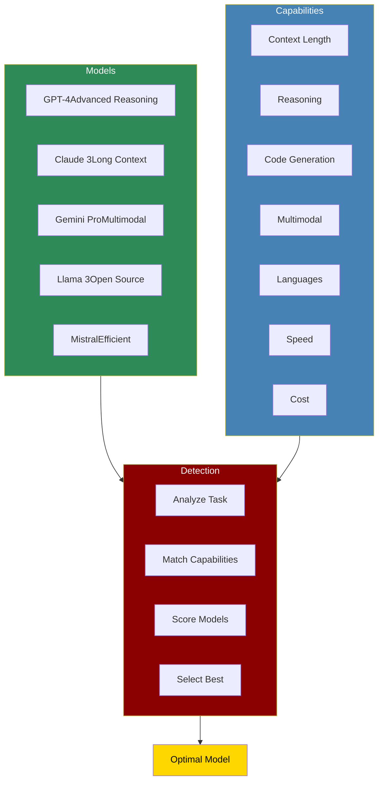

# Model Capabilities



The Model Capabilities system provides comprehensive feature detection and comparison across different LLMs, enabling intelligent model selection based on specific task requirements.

## Quick Start

## Understanding Model Capabilities

## Core Features

## Model Capability Profiles

### GPT-4 Family

```python
gpt4_capabilities = {
 "gpt-4": {
 "max_context": 128000,
 "strengths": ["reasoning", "coding", "analysis", "math"],
 "weaknesses": ["speed", "cost"],
 "languages": 95,
 "multimodal": False,
 "cost_per_1k_tokens": {"input": 0.03, "output": 0.06},
 "latency": "medium",
 "use_cases": ["complex reasoning", "code generation", "technical analysis"]
 },
 "gpt-4-turbo": {
 "max_context": 128000,
 "strengths": ["reasoning", "speed", "cost-efficiency"],
 "weaknesses": ["very long contexts"],
 "languages": 95,
 "multimodal": True,
 "cost_per_1k_tokens": {"input": 0.01, "output": 0.03},
 "latency": "low",
 "use_cases": ["general tasks", "multimodal analysis", "rapid responses"]
 }
}
```

### Claude 3 Family

```python
claude3_capabilities = {
 "claude-3-opus": {
 "max_context": 200000,
 "strengths": ["long_context", "reasoning", "writing", "safety"],
 "weaknesses": ["cost", "speed"],
 "languages": 80,
 "multimodal": True,
 "cost_per_1k_tokens": {"input": 0.015, "output": 0.075},
 "latency": "high",
 "use_cases": ["document analysis", "creative writing", "complex tasks"]
 },
 "claude-3-sonnet": {
 "max_context": 200000,
 "strengths": ["balance", "long_context", "efficiency"],
 "weaknesses": ["specialized tasks"],
 "languages": 80,
 "multimodal": True,
 "cost_per_1k_tokens": {"input": 0.003, "output": 0.015},
 "latency": "medium",
 "use_cases": ["general purpose", "document processing", "balanced tasks"]
 }
}
```

## Capability Detection Methods

```python
from praisonaiagents.llm import ModelCapabilities, CapabilityTest

# Initialize capability detector

detector = ModelCapabilities()

# Run comprehensive capability tests

test_suite = CapabilityTest()

# Test reasoning capabilities

reasoning_score = test_suite.test_reasoning("gpt-4")
print(f"Reasoning score: {reasoning_score}/100")

# Test context handling

context_test = test_suite.test_context_length("claude-3-sonnet", tokens=150000)
print(f"Context handling: {'Passed' if context_test else 'Failed'}")

# Test multilingual support

languages = test_suite.test_languages("gpt-4")
print(f"Supported languages: {len(languages)}")

# Test specialized capabilities

capabilities_matrix = test_suite.run_full_test_suite([
 "gpt-4",
 "claude-3-opus",
 "gemini-pro",
 "llama-3-70b"
])

# Generate capability report

detector.generate_capability_report(capabilities_matrix, "model_comparison.html")
```

## Advanced Capability Matching

### Task-Based Selection

```python
# Define task profiles

task_profiles = {
 "code_review": {
 "required": ["code_understanding", "bug_detection", "suggestions"],
 "preferred": ["fast_response", "cost_effective"],
 "context": 10000
 },
 "research_paper": {
 "required": ["long_context", "academic_writing", "citations"],
 "preferred": ["reasoning", "fact_checking"],
 "context": 50000
 },
 "real_time_chat": {
 "required": ["low_latency", "conversational"],
 "preferred": ["cost_effective", "multilingual"],
 "context": 4000
 }
}

# Match capabilities to tasks

for task_name, requirements in task_profiles.items():
 best_model = detector.match_task_to_model(requirements)
 score = detector.calculate_match_score(best_model, requirements)
 print(f"{task_name}: {best_model} (score: {score:.2f})")
```

### Dynamic Capability Updates

```python
# Monitor and update capabilities based on performance

detector.enable_performance_tracking()

# After task execution

detector.update_capability_metrics(
 model="gpt-4",
 task_type="coding",

)

# Get updated recommendations based on real performance

updated_recommendation = detector.recommend_with_history(
 task_requirements,
 consider_performance=True
)
```

## Capability Comparison Tools

## Best Practices

## Troubleshooting

## Model-Specific Features

## Next Steps