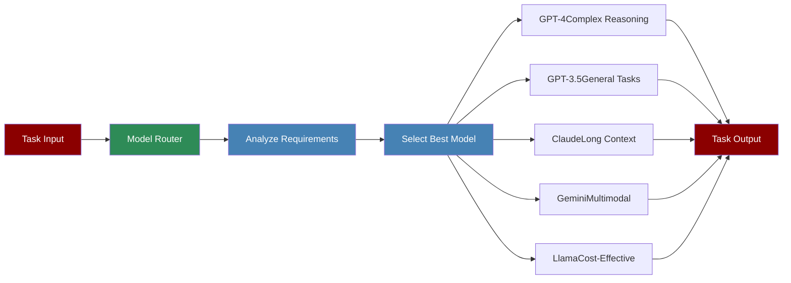

# Model Router System



The Model Router System intelligently selects the most appropriate LLM for each task based on requirements, capabilities, and cost considerations, ensuring optimal performance and resource utilization.

## Quick Start

## Understanding Model Router

## Features

## Configuration Options

```python
# Initialize router with custom configuration

router = ModelRouter(
 ,
 "gpt-3.5-turbo": {
 "max_tokens": 16000,
 "strengths": ["general", "fast"],
 "cost_per_1k_tokens": 0.001
 },
 "claude-3-sonnet": {
 "max_tokens": 200000,
 "strengths": ["long_context", "writing"],
 "cost_per_1k_tokens": 0.015
 }
 },

 # Routing rules

 "routing_rules": {
 "complex_reasoning": ["gpt-4", "claude-3-opus"],
 "simple_tasks": ["gpt-3.5-turbo", "llama-3"],
 "long_context": ["claude-3-sonnet", "gpt-4-turbo"],
 "coding": ["gpt-4", "deepseek-coder"],
 "multimodal": ["gpt-4-vision", "gemini-pro-vision"]
 },

 # Fallback configuration

 "fallback_enabled": True,
 "fallback_models": ["gpt-3.5-turbo", "llama-3"]
 }
)

# Use router with specific task hints

result = router.route_task(
 task_description="Analyze complex financial data",

)
```

## Advanced Usage

### Custom Routing Logic

```python
from praisonaiagents.llm import ModelRouter, RoutingCriteria

class CustomRouter(ModelRouter):
 def custom_routing_logic(self, task, criteria):
 # Add custom logic for specific use cases

 if "legal" in task.description.lower():
 return "claude-3-opus" # Better for legal documents

 if criteria.urgency == "high":
 return "gpt-3.5-turbo" # Fastest response

 return super().route(task, criteria)

# Use custom router

custom_router = CustomRouter()
```

### Routing Analytics

```python
# Get routing statistics

stats = router.get_statistics()
print(f"Total tasks routed: {stats['total_tasks']}")
print(f"Model usage breakdown: {stats['model_usage']}")
print(f"Average cost per task: ${stats['avg_cost']}")
print(f"Performance metrics: {stats['performance']}")

# Export routing history

router.export_history("routing_history.json")
```

## Model Selection Criteria

The router considers multiple factors when selecting models:

## Best Practices

## Troubleshooting

## Next Steps