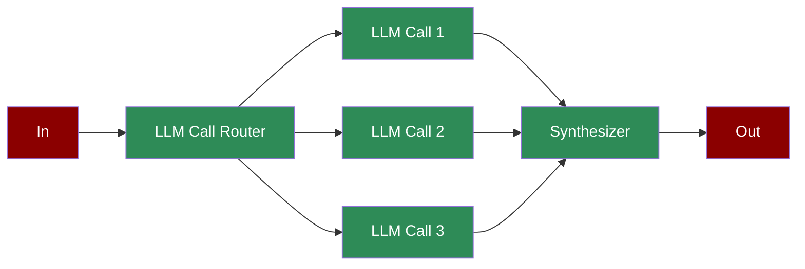

# Agentic Orchestrator Worker



A workflow with a central orchestrator directing multiple worker LLMs to perform subtasks, synthesizing their outputs for complex, coordinated operations.

## Quick Start

## Understanding Orchestrator-Worker Pattern

## Features

## Configuration Options

```python
# Create an orchestrator agent

router = Agent(
 name="Router",
 role="Task router",
 goal="Distribute tasks based on conditions",
 tools=[get_time_check], # Tools for routing decisions

 verbose=True # Enable detailed logging

)

# Create a worker agent

worker = Agent(
 name="Worker",
 role="Specialized worker",
 goal="Handle specific task type",
 instructions="Processing instructions"
)

# Create routing task

router_task = Task(
 name="route_task",
 description="Route tasks to workers",
 agent=router,
 is_start=True,
 task_type="decision",

)

# Create synthesis task

synthesis_task = Task(
 name="synthesize",
 description="Combine worker results",
 agent=synthesizer,
 context=[worker1_task, worker2_task] # Reference worker tasks

)
```

## Troubleshooting

## Next Steps