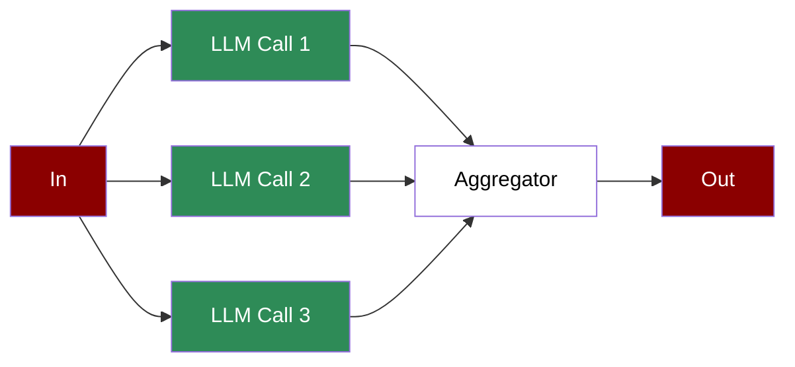

# Agentic Parallelization



A workflow that distributes tasks across multiple LLM calls simultaneously, aggregating results to handle complex or large-scale operations efficiently.

## Quick Start

## Understanding Parallelisation

## Features

## Configuration Options

```python
# Create a parallel task

task = Task(
 name="parallel_task",
 description="Task to run in parallel",
 expected_output="Task result",
 agent=agent,
 is_start=True,
 async_execution=True # Enable parallel execution

)

# Create an aggregator task

aggregator_task = Task(
 name="aggregate",
 description="Aggregate results from parallel tasks",
 expected_output="Combined results",
 agent=aggregator,
 context=[task1, task2, task3] # Reference parallel tasks

)

# Async workflow execution

async def run_workflow():
 workflow = PraisonAIAgents(
 agents=[agent1, agent2, aggregator],
 tasks=[task1, task2, aggregator_task],
 process="workflow",
 verbose=True
 )
 results = await workflow.astart()
```

## Troubleshooting

## Next Steps