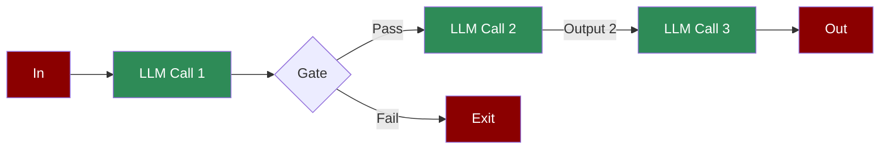

# Agentic Prompt Chaining



A workflow where the output of one LLM call becomes the input for the next. This sequential design allows for structured reasoning and step-by-step task completion.

## Quick Start

## Understanding Prompt Chaining

## Features

## Configuration Options to exit the chain

```python
# Task with chaining configuration

task = Task(
 name="time_check",
 description="Check time and make decision",
 expected_output="Time check result",
 agent=agent,
 is_start=True,
 task_type="decision",
 next_tasks=["next_step"],

)
```

```python
task = Task(
 name="time_check",
 description="Check time and make decision",
 expected_output="Time check result",
 agent=agent,
 is_start=True,
 task_type="decision",
 next_tasks=["next_step"],

)
```

```python
task = Task(
 name="time_check",
 description="Check time and make decision",
 expected_output="Time check result",
 agent=agent,
 is_start=True,
 task_type="decision",
 next_tasks=["next_step"],

)
```

```python
task = Task(
 name="time_check",
 description="Check time and make decision",
 expected_output="Time check result",
 agent=agent,
 is_start=True,
 task_type="decision",
 next_tasks=["next_step"],

)
```

## Troubleshooting

## Next Steps