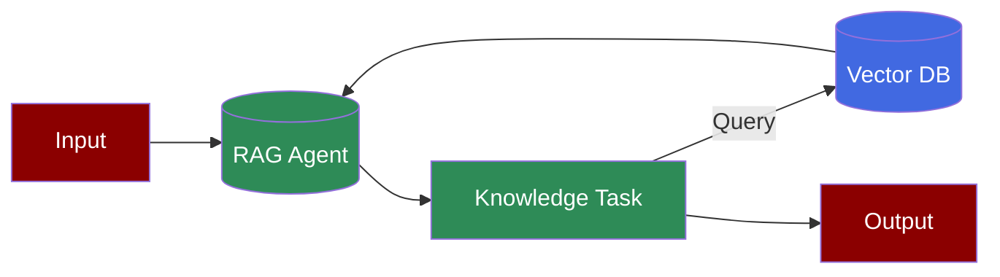
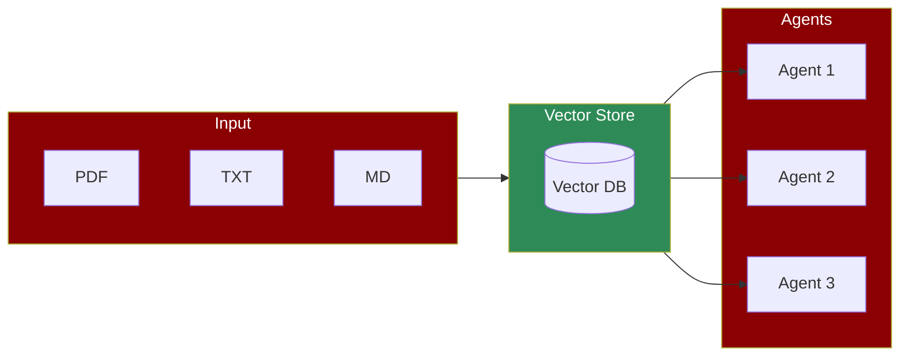

# RAG Agents



A knowledge-centric workflow where RAG (Retrieval Augmented Generation) agents interact with vector databases to store and retrieve information efficiently, enabling sophisticated question-answering and information retrieval capabilities.

## Quick Start

## Data Indexing and Retrieval Agents



The simplest way to create a knowledge-based agent is without any configuration:

```python
from praisonaiagents import Agent

agent = Agent(
 name="Knowledge Agent",
 instructions="You answer questions based on the provided knowledge.",
 knowledge=["small.pdf"] # Indexing

)

agent.start("What is KAG in one line?") # Retrieval

```

### Advanced Configuration

For more control over the knowledge base, you can specify a configuration:

```python
from praisonaiagents import Agent

config = {
 "vector_store": {
 "provider": "chroma",
 "config": {
 "collection_name": "praison",
 "path": ".praison",
 }
 }
}

agent = Agent(
 name="Knowledge Agent",
 instructions="You answer questions based on the provided knowledge.",
 knowledge=["small.pdf"], # Indexing

 knowledge_config=config # Configuration

)

agent.start("What is KAG in one line?") # Retrieval

```

### Multi-Agent Knowledge System

For more complex scenarios, you can create a knowledge-based system with multiple agents:

```python
from praisonaiagents import Agent, Task, PraisonAIAgents
import logging
import os

# Configure logging

logging.basicConfig(level=logging.INFO, format='%(asctime)s - %(levelname)s - %(message)s')
logger = logging.getLogger(__name__)

# Define the configuration for the Knowledge instance

config = {
 "vector_store": {
 "provider": "chroma",
 "config": {
 "collection_name": "praison",
 "path": ".praison",
 }
 }
}

# Create an agent with knowledge capabilities

knowledge_agent = Agent(
 name="KnowledgeAgent",
 role="Information Specialist",
 goal="Store and retrieve knowledge efficiently",
 backstory="Expert in managing and utilizing stored knowledge",
 knowledge=["sample.pdf"], # Indexing

 knowledge_config=config, # Configuration

 verbose=True
)

# Define a task for the agent

knowledge_task = Task(
 name="knowledge_task",
 description="Who is Mervin Praison?",
 expected_output="Answer to the question",
 agent=knowledge_agent # Agent

)

# Create and start the agents

agents = PraisonAIAgents(
 agents=[knowledge_agent],
 tasks=[knowledge_task],
 process="sequential",
 user_id="user1" # User ID

)

# Start execution

result = agents.start() # Retrieval

```

## Retrieval Agents

### Adding Knowledge to RAG Agents

```python
from praisonaiagents import Agent

config = {
 "vector_store": {
 "provider": "chroma",
 "config": {
 "collection_name": "praison",
 "path": ".praison",
 }
 }
}

agent = Agent(
 name="Knowledge Agent",
 instructions="You answer questions based on the provided knowledge.",
 knowledge=["small.pdf"], # Indexing

 knowledge_config=config # Configuration

)

agent.start("What is KAG in one line?") # Retrieval

```

## Understanding RAG Agents

## Features

## Troubleshooting

## Next Steps