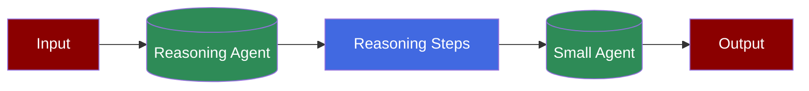

# Reasoning Extract Agents



A workflow where a reasoning agent breaks down complex problems into steps, followed by a smaller agent that processes these steps to provide concise answers.

## Prerequisites

## Code

```python
from praisonaiagents import Agent, Task, PraisonAIAgents

reasoning_agent = Agent(
 role="Helpful Assistant",
 reasoning_steps=True,
 llm="deepseek/deepseek-reasoner"
)

small_agent = Agent(
 role="Helpful Assistant",
 llm="gpt-3.5-turbo"
)

reasoning_task = Task(
 description="How many r's in the word 'Strawberry'?",
 agent=reasoning_agent
)

small_task = Task(
 description="With the provided reasoning tell me how many r's in the word 'Strawberry'?",
 agent=small_agent
)

agents = PraisonAIAgents(
 agents=[reasoning_agent, small_agent],
 tasks=[reasoning_task, small_task]
)

agents.start()
```

## Features

## Understanding Reasoning Agents

## Troubleshooting